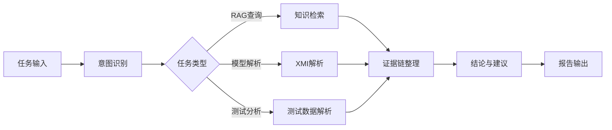
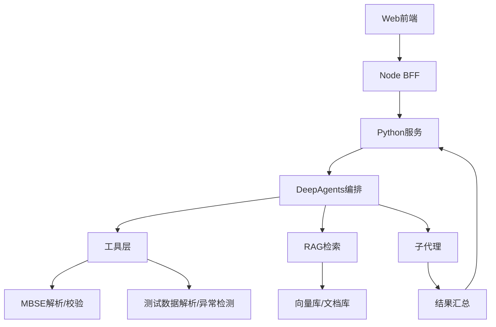
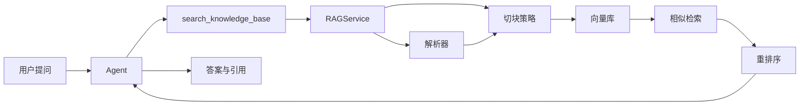
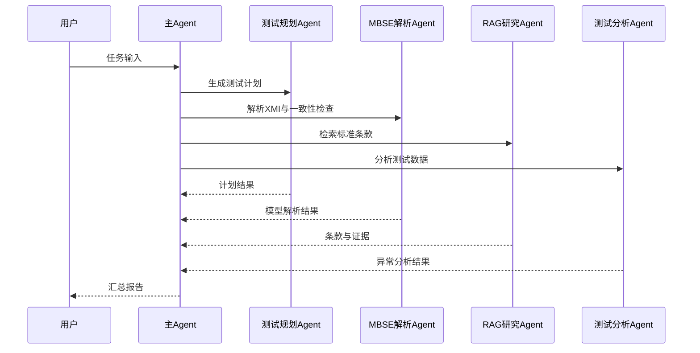

# DeepAgents 项目功能与实测状态总结（面向卫星测试与 MBSE 场景）

## 1. 当前代码框架概览

- **核心框架**：基于 `deepagents` 的 LangGraph Agent Harness，支持工具、子代理、技能、记忆与中间件扩展。[README.md](file:///d:/MASrepos/deepagents-langchain/README.md)
- **Web 形态**：前端（Vue）+ Node 中间层 + Python FastAPI 服务三层结构。[deepagents-web README](file:///d:/MASrepos/deepagents-langchain/libs/deepagents-web/README.md)
- **Python 服务侧 Agent 初始化**：在 Web 服务中用 `create_deep_agent` 组装工具、Memory、Skills、Shell 中间件，并从 JSON 加载子代理。[app.py:_init_agent](file:///d:/MASrepos/deepagents-langchain/libs/deepagents-web/services/python/app.py#L598-L747)
- **RAG 体系**：Python 侧 RAGService + 配置化解析/切块/向量库，提供检索工具给 Agent。[rag_service.py](file:///d:/MASrepos/deepagents-langchain/libs/deepagents-web/services/python/rag_service.py) [rag_config.json](file:///d:/MASrepos/deepagents-langchain/libs/deepagents-web/services/python/rag_config.json) [rag_tool.py](file:///d:/MASrepos/deepagents-langchain/libs/deepagents-web/services/python/rag_tool.py)
- **MBSE Agent 原型**：已有 SysML XMI 解析/生成/校验/RAG 工具 + Agent 编排原型，当前位于 `libs/assemble_agents/mbse_agent`。[agent.py](file:///d:/MASrepos/deepagents-langchain/libs/assemble_agents/mbse_agent/agent.py) [parser.py](file:///d:/MASrepos/deepagents-langchain/libs/assemble_agents/mbse_agent/tools/parser.py) [generator.py](file:///d:/MASrepos/deepagents-langchain/libs/assemble_agents/mbse_agent/tools/generator.py) [validator.py](file:///d:/MASrepos/deepagents-langchain/libs/assemble_agents/mbse_agent/tools/validator.py) [rag.py](file:///d:/MASrepos/deepagents-langchain/libs/assemble_agents/mbse_agent/tools/rag.py)
- **MBSE 分析器设计文档**：包含知识图谱/Neo4j/向量库的分层设计，属于规划设计稿。[architecture.md](file:///d:/MASrepos/deepagents-langchain/libs/assemble_agents/mbse_analyzer/architecture.md)

## 2. 目前项目功能与集成状态（基于代码与文档标注）

### 2.1 已实现并可用的能力
- **知识库与 RAG**：支持上传、解析、向量入库、检索；解析策略与切块模板配置化。[TODO_FRONTEND_BACKEND_GAP.md](file:///d:/MASrepos/deepagents-langchain/TODO_FRONTEND_BACKEND_GAP.md#L5-L24) [rag_config.json](file:///d:/MASrepos/deepagents-langchain/libs/deepagents-web/services/python/rag_config.json)
- **工具与技能管理**：前端 Skills 视图联通后端工具清单接口。[TODO_FRONTEND_BACKEND_GAP.md](file:///d:/MASrepos/deepagents-langchain/TODO_FRONTEND_BACKEND_GAP.md#L25-L32)
- **子代理配置**：后端从 JSON 读写子代理定义，并在 Agent 初始化时加载。[app.py](file:///d:/MASrepos/deepagents-langchain/libs/deepagents-web/services/python/app.py#L712-L744)
- **会话持久化**：Python 服务已使用 SQLite 保存会话与消息日志。[db.py](file:///d:/MASrepos/deepagents-langchain/libs/deepagents-web/services/python/db.py#L8-L189)

### 2.2 当前仍存在的缺口或不完整点
- **RAG 高精解析模型未就绪**：MinerU 模型需手工下载，现有逻辑会降级为 PyMuPDF。[TODO_FRONTEND_BACKEND_GAP.md](file:///d:/MASrepos/deepagents-langchain/TODO_FRONTEND_BACKEND_GAP.md#L21-L23)
- **Plan Graph 与 LangGraph 运行态不一致**：前端图仅基于聊天历史，不反映真实执行图。[TODO_FRONTEND_BACKEND_GAP.md](file:///d:/MASrepos/deepagents-langchain/TODO_FRONTEND_BACKEND_GAP.md#L33-L39)
- **运行态状态仍有内存依赖**：运行流式会话与状态管理仍保留内存状态，重启后运行态不可恢复。[app.py](file:///d:/MASrepos/deepagents-langchain/libs/deepagents-web/services/python/app.py#L107-L156)
- **MBSE Agent 未接入 Web 工作流**：MBSE 工具与 Agent 位于 `libs/assemble_agents`，但未在 Web Python 服务的工具栈中接入。

### 2.3 实测状态说明
本次总结基于代码与文档标注，未在本会话中启动服务或执行端到端验证。若需“实测状态”可追溯，需要补充运行环境信息与 E2E 结果记录。

## 3. 面向卫星测试与 MBSE 设计任务的补全清单

### 3.1 Skills（面向流程的可复用 SOP）
建议以 `skills/<skill-name>/SKILL.md` 的形式建立标准流程，重点覆盖：
- **卫星测试流程类**：环境/载荷/功耗/热真空/电磁兼容测试 SOP，包含输入模板、判定标准、异常分支处理。
- **测试工单与报告类**：测试计划生成、测试记录标准化、异常分析与整改闭环报告。
- **MBSE 设计类**：需求建模、结构/行为建模、接口建模、验证策略与追踪矩阵生成。
- **合规与标准类**：引用企业标准、行业规范、测试约束与验收标准的引用方式与优先级规则。

### 3.2 Tools（结构化能力与系统接口）
需要将“任务能力”从 Prompt 变为工具，让 Agent 能稳定调用：
- **模型与数据解析**：扩展 XMI 解析到 Requirement/UseCase/Interface/Constraint 等元素，建立统一的中间表示（IR）。
- **测试数据处理**：遥测日志解析、单位换算、参数趋势分析、异常检测（阈值/统计/规则）。
- **模型一致性与合规校验**：基于流程图或需求关系的自动校验（替换当前 mock 图逻辑）。[validator.py](file:///d:/MASrepos/deepagents-langchain/libs/assemble_agents/mbse_agent/tools/validator.py#L6-L95)
- **知识图谱写入/查询**：若采用 Neo4j，则提供模型元素与关系的写入/查询工具。
- **报告生成与归档**：统一输出格式（PDF/Markdown/JSON），并落盘到可检索目录。

### 3.3 Agents（面向复杂任务的角色拆分）
建议建立一组长期稳定的角色型子代理，并挂接到 Web 或 CLI：
- **测试规划 Agent**：生成测试计划、步骤与资源清单。
- **测试执行/分析 Agent**：解析测试数据并形成结论。
- **MBSE 解析 Agent**：专门处理 SysML/XMI 解析与模型一致性检查。
- **RAG 研究 Agent**：围绕标准条款和历史案例进行检索与比对。
- **协同治理 Agent**：合规性/风险/审计与版本控制建议。

### 3.4 Memory（长期上下文与项目记忆）
需要在“长期项目上下文”层引入可持久记忆：
- **项目级 AGENTS.md**：沉淀卫星型号、测试平台、指标约束、关键风险等长期上下文。
- **会话级知识沉淀**：从对话产出中抽取关键决策、参数与异常记录写入记忆。
- **版本与变更历史**：记录测试计划版本、模型版本与差异来源，避免迭代丢失。

### 3.5 RAG（面向标准与历史资产的检索体系）
建议构建多源知识库与模板化切块策略，保证检索质量：
- **数据源**：SysML 规范、企业测试标准、历史测试报告、MBSE 模型导出文档、设计评审记录。
- **模板切块**：为测试规范、测试步骤、异常记录、接口定义等设定结构化分段模板。[rag_config.json](file:///d:/MASrepos/deepagents-langchain/libs/deepagents-web/services/python/rag_config.json#L23-L57)
- **混合检索策略**：向量检索 + 关键字召回 + rerank（参考 MBSE RAG 原型）。[rag.py](file:///d:/MASrepos/deepagents-langchain/libs/assemble_agents/mbse_agent/tools/rag.py#L9-L84)
- **引用与证据链**：输出回答时绑定来源片段与元数据，方便审计与复核。

## 4. 最小闭环落地路径（建议）

1. **技能与工具先落地**：优先将卫星测试 SOP 和 MBSE 关键工具实现为可调用工具。
2. **MBSE Agent 接入 Web**：将 `mbse_agent` 的工具注册到 Python 服务的 Agent 工具列表。
3. **RAG 统一化**：复用现有 RAGService，在 MBSE/测试领域建立专用数据源与模板。
4. **状态持久化增强**：补齐运行态状态与任务轨迹持久化，保证可追溯。
5. **评估基线**：定义测试样例与模型样例，固定“基准问题”进行回归验证。

## 5. 可执行任务清单与里程碑

### 5.1 任务清单（按落地顺序）
1. **领域知识资产入库准备**
   - 收集 SysML 规范、企业测试规范、历史测试报告、模板与术语表
   - 产出：数据源清单、敏感信息脱敏规则、入库目录结构
2. **RAG 模板与索引管线固化**
   - 在 `rag_config.json` 建立“测试规范/测试计划/异常报告/接口定义”模板
   - 构建批量入库脚本或服务端批入端点
   - 产出：RAG 模板集 + 可重复的入库流程
3. **MBSE 解析与 IR 统一**
   - 扩展 XMI 解析覆盖 Requirement/UseCase/Interface/Constraint
   - 产出：统一中间表示（IR）与结构化 JSON Schema
4. **测试数据处理工具化**
   - 实现遥测日志解析、单位换算、阈值/统计异常检测
   - 产出：稳定工具 API + 输入输出规范
5. **合规校验与流程引擎实装**
   - 替换 mock 流程，基于真实模型或流程图构建校验图
   - 产出：可复用的合规校验工具与规则配置
6. **Agent 角色与路由策略**
   - 定义测试规划/执行分析/MBSE 解析/RAG 研究/治理子代理
   - 产出：子代理配置与任务分派规则
7. **Web 工作流接入**
   - 将 MBSE/测试工具注册到 Web Python 服务
   - 产出：端到端调用闭环（Web -> Node -> Python -> Tools）
8. **评估基线与回归集**
   - 建立固定样例集、问题集、评分标准
   - 产出：回归报告与结果追踪表

### 5.2 里程碑（M1–M4）
- **M1：RAG 与知识库闭环**
  - 完成数据入库流程与模板切块
  - Agent 能引用标准条款回答问题
- **M2：MBSE 解析与合规校验闭环**
  - XMI 解析覆盖核心元素
  - 合规校验从 mock 切换为真实流程图
- **M3：测试数据分析闭环**
  - 遥测日志解析与异常检测可稳定调用
  - 输出结构化测试结论与证据链
- **M4：多 Agent 协同与 Web 交付闭环**
  - 子代理与 Web UI 成功协同
  - 形成“输入任务 -> 输出报告/建议”的完整链路

### 5.2.1 M1 具体实施方案（工程可实操）
1. **准备知识库目录与数据源**
   - 在 `libs/deepagents-web/services/python/` 约定数据源目录结构（如 `kb_sources/标准/测试规范/历史报告`）
   - 将 SysML 规范 PDF、企业测试规范 DOCX、历史报告 PDF/MD 放入目录
2. **配置切块模板**
   - 修改 `libs/deepagents-web/services/python/rag_config.json`
   - 新增 `templates` 条目：`test_spec`、`test_plan`、`anomaly_report`、`interface_def`
   - 为每个模板设置 `chunk_size`、`chunk_overlap`、`separators`
3. **验证解析与入库链路**
   - 启动 Python 服务后调用 `/kb/upload` 上传样例文件
   - 验证 `rag_service.py` 的解析策略走到 `docx_text` 或 `pymupdf` 分支
4. **检索与引用输出**
   - 调用 `search_knowledge_base` 工具验证能返回来源与片段
   - 确保返回内容包含来源文件名与片段文本
5. **完成标准**
   - 至少 3 类文档成功入库并可检索命中
   - Top-3 检索结果中能找到正确条款
6. **工程操作清单（文件级）**
   - 编辑 `libs/deepagents-web/services/python/rag_config.json` 增加领域模板
   - 使用 `libs/deepagents-web/services/python/download_models.py` 下载解析模型（如需高精解析）
   - 通过 `/kb/upload` 完成批量入库并检查 `libs/assemble_agents/kb_sources.json`
7. **验收样例**
   - 关键问题示例：输入“电压测试的验收标准是什么”
   - 预期输出：包含来源文件名与条款片段
8. **接口与数据模板（示例）**
   - 上传入库请求（Web BFF -> Python）

```json
{
  "file": "@Test_Spec_V1.0.docx",
  "template": "test_spec"
}
```

   - 检索请求（工具调用输入）

```json
{
  "query": "电压测试的验收标准是什么"
}
```

### 5.2.2 M2 具体实施方案（工程可实操）
1. **扩展 XMI 解析范围**
   - 修改 `libs/assemble_agents/mbse_agent/tools/parser.py`
   - 在 XPath 中新增 Requirement/UseCase/Interface/Constraint 的解析
   - 输出统一结构 `{requirements:[], use_cases:[], interfaces:[], constraints:[]}`
2. **统一 IR 数据结构**
   - 在 `libs/assemble_agents/mbse_agent/utils/schemas.py` 定义 IR 模型字段
   - 解析工具输出字段与 IR 对齐
3. **替换合规校验 mock 数据**
   - 修改 `libs/assemble_agents/mbse_agent/tools/validator.py`
   - 将 `mock_activities` 改为通过 `parse_sysml_xmi` 或 IR 加载真实流程图
4. **验证校验逻辑**
   - 准备最小 XMI 样例，包含 3-5 个节点与约束
   - 调用 `validate_operation_state` 验证合法与非法路径
5. **完成标准**
   - 解析覆盖核心元素并形成结构化 IR
   - 校验结果能反映真实流程图与约束
6. **工程操作清单（文件级）**
   - 修改 `libs/assemble_agents/mbse_agent/utils/schemas.py` 增加 Requirement/UseCase/Interface/Constraint 模型
   - 修改 `libs/assemble_agents/mbse_agent/tools/parser.py` 输出对齐 IR 的字段
   - 修改 `libs/assemble_agents/mbse_agent/tools/validator.py` 以 IR 构建图结构
7. **验收样例**
   - 输入：`current_step_name="电压测试", parameters={"voltage":60}`
   - 预期：返回 `valid=False` 与约束原因
8. **IR 输出模板（示例）**

```json
{
  "blocks": [{"id": "b1", "name": "PowerUnit"}],
  "activities": [{"id": "a1", "name": "VoltageTest"}],
  "requirements": [{"id": "r1", "text": "电压<=50V"}],
  "use_cases": [{"id": "u1", "name": "ExecuteVoltageTest"}],
  "interfaces": [{"id": "i1", "name": "PowerBus"}],
  "constraints": [{"id": "c1", "expr": "voltage<=50"}]
}
```

### 5.2.3 M3 具体实施方案（工程可实操）
1. **新增测试数据解析工具**
   - 在 `libs/assemble_agents/mbse_agent/tools/` 增加遥测解析工具文件
   - 定义输入格式（CSV/JSON），输出标准化字段（时间、参数、单位、数值）
2. **异常检测与趋势分析**
   - 实现阈值检测与简单统计异常（均值偏差/峰值）
   - 输出包含异常片段索引与触发规则
3. **报告输出结构化**
   - 生成统一 JSON 报告结构，包含摘要、异常列表、证据片段
4. **接入 Agent 工具栈**
   - 在 Web Python 服务的 Agent 初始化中加入新工具
5. **完成标准**
   - 固定样例可产出结构化异常结论
   - 证据链可追溯到原始数据片段
6. **工程操作清单（文件级）**
   - 新增工具文件并在 `libs/assemble_agents/mbse_agent/tools/__init__.py` 导出
   - 在 `libs/deepagents-web/services/python/app.py` 的 `agent_tools` 中注册
   - 为异常检测定义统一 JSON 报告结构
7. **验收样例**
   - 输入：包含电压/电流/温度的 CSV
   - 预期：输出异常时间段与触发阈值
8. **测试数据输入/输出模板（示例）**

```json
{
  "columns": ["timestamp", "param", "unit", "value"],
  "rows": [
    ["2026-01-01T10:00:00Z", "voltage", "V", 48.1],
    ["2026-01-01T10:00:01Z", "voltage", "V", 60.2]
  ]
}
```

```json
{
  "summary": "发现电压异常",
  "anomalies": [
    {"param": "voltage", "threshold": "<=50", "time": "2026-01-01T10:00:01Z", "value": 60.2}
  ],
  "evidence": ["rows[1]"]
}
```

### 5.2.4 M4 具体实施方案（工程可实操）
1. **子代理配置与加载**
   - 在 `libs/deepagents-web/services/python/` 的子代理 JSON 中配置角色与提示词
   - 确保 `app.py` 的子代理加载逻辑可读到配置
2. **Web 端调用闭环**
   - 确认 Node BFF 已能转发 `/chat`、`/kb`、`/agents` 等请求
   - Web UI 通过对话触发子代理任务并回流结果
3. **可视化与证据展示**
   - 在前端对话中展示 RAG 来源与工具调用结果
4. **完成标准**
   - Web 端从任务输入到报告输出可一条链路完成
   - 子代理结果可被主 Agent 汇总输出
5. **工程操作清单（文件级）**
   - 配置 `libs/assemble_agents/subagents.json` 并通过 `/agents/subagents` 校验写入
   - 在前端触发工具调用并展示 `tool` 事件输出
   - 确保 RAG 输出引用在 UI 中可见
6. **验收样例**
   - 输入：要求生成测试计划并引用规范条款
   - 预期：主 Agent 汇总子代理输出并附带引用
7. **子代理配置模板（示例）**

```json
[
  {
    "name": "test-planner",
    "description": "生成测试计划与步骤",
    "system_prompt": "专注于生成可执行测试计划"
  },
  {
    "name": "mbse-parser",
    "description": "解析 SysML/XMI 模型",
    "system_prompt": "专注于模型解析与一致性检查"
  }
]
```

### 5.3 周计划（示例 4 周）
| 周次 | 目标里程碑 | 关键交付 | 完成标准 |
| --- | --- | --- | --- |
| 第 1 周 | M1 | 知识库目录与入库流程、RAG 模板集 | 能完成一次端到端入库并检索命中 |
| 第 2 周 | M2 | XMI 解析扩展、IR 与校验规则 | 解析覆盖核心元素并输出结构化结果 |
| 第 3 周 | M3 | 测试数据解析与异常检测工具 | 固定样例可输出异常结论与证据链 |
| 第 4 周 | M4 | 子代理协同与 Web 闭环 | Web 端完成从输入到报告的闭环 |

### 5.4 人天估算（可按 2 人团队调整）
| 工作包 | 人天估算 |
| --- | --- |
| 数据入库与模板切块 | 6 人天 |
| XMI 解析扩展与 IR | 8 人天 |
| 合规校验与规则配置 | 6 人天 |
| 测试数据处理与异常检测 | 8 人天 |
| 子代理编排与路由 | 4 人天 |
| Web 接入与联调 | 6 人天 |
| 评估基线与回归 | 4 人天 |
| **总计** | **42 人天** |

## 6. 实施技术路线图与方案

### 6.1 路线图分层（数据层 → 工具层 → Agent 层 → 交付层）
1. **数据层**
   - 统一知识源目录与元数据规范
   - 结构化样例与测试规范先入库
2. **工具层**
   - MBSE 解析工具扩展
   - 测试数据处理与异常检测工具
   - 合规校验与流程推理工具
3. **Agent 层**
   - 主 Agent 负责编排与路由
   - 子代理按角色处理专项任务
4. **交付层**
   - Web UI 展示检索证据与执行轨迹
   - 输出标准化测试报告与模型建议

### 6.1.1 业务流程图



### 6.1.2 功能架构图



### 6.1.3 RAG 数据流图



### 6.1.4 子代理协同图



### 6.2 关键技术方案细节

#### 6.2.1 RAG 方案
- **检索策略**：向量检索 + 关键词召回 + rerank
- **切块模板**：按“测试步骤/约束条件/验收标准/接口定义”分段
- **证据链**：输出包含来源文件名、章节、段落号

#### 6.2.2 MBSE 解析与 IR
- **解析范围**：Block/Activity/Requirement/UseCase/Interface/Constraint
- **IR 结构**：统一实体、关系、属性，便于 RAG 与图谱写入
- **校验机制**：基于 IR 构建流程图与约束规则

#### 6.2.3 测试数据处理
- **输入**：遥测 CSV/日志/二进制导出
- **处理**：单位换算、阈值检查、趋势检测
- **输出**：结构化结论 + 异常片段索引

#### 6.2.4 多 Agent 协同
- **主 Agent**：负责任务拆解、工具选择、结果整合
- **子代理**：领域角色化任务处理，提高可控性与可解释性
- **路由策略**：基于意图识别与任务类型选择子代理

### 6.3 交付物定义
- **数据层交付**：标准化知识库目录 + 入库脚本/端点
- **工具层交付**：解析/校验/分析/报告工具 API
- **Agent 层交付**：可配置子代理与路由策略
- **交付层交付**：Web UI 展示与报告输出模板

### 6.4 验收指标（可量化）
- **RAG 命中率**：固定 30 条问题集中 Top-3 命中率 ≥ 80%
- **解析覆盖度**：XMI 解析覆盖 Block/Activity/Requirement/UseCase/Interface/Constraint
- **合规校验准确率**：基准流程样例正确判定率 ≥ 90%
- **测试异常检出率**：基准样例异常检出率 ≥ 85%
- **端到端闭环**：Web 端完成任务闭环成功率 ≥ 90%

### 6.5 风险矩阵（示例）
| 风险 | 影响 | 概率 | 应对 |
| --- | --- | --- | --- |
| 知识库质量不稳定 | 检索准确率下降 | 中 | 建立入库前清洗与人工抽检 |
| XMI 解析差异 | 解析失败或缺失 | 中 | 增加多工具适配与回退策略 |
| 规则维护成本高 | 合规校验失准 | 中 | 规则参数化与版本管理 |
| 测试数据格式多样 | 工具泛化不足 | 高 | 先覆盖主流格式并逐步扩展 |
| Web 联调阻塞 | 交付延期 | 中 | 提前定义接口契约与 mock |

## 7. 关键引用索引
- DeepAgents 核心能力：[README.md](file:///d:/MASrepos/deepagents-langchain/README.md)
- Web 形态入口：[deepagents-web README](file:///d:/MASrepos/deepagents-langchain/libs/deepagents-web/README.md)
- Web Agent 初始化与中间件：[app.py:_init_agent](file:///d:/MASrepos/deepagents-langchain/libs/deepagents-web/services/python/app.py#L598-L747)
- RAG 结构：[rag_service.py](file:///d:/MASrepos/deepagents-langchain/libs/deepagents-web/services/python/rag_service.py) [rag_tool.py](file:///d:/MASrepos/deepagents-langchain/libs/deepagents-web/services/python/rag_tool.py)
- RAG 配置与切块模板：[rag_config.json](file:///d:/MASrepos/deepagents-langchain/libs/deepagents-web/services/python/rag_config.json)
- 前后端集成状态：[TODO_FRONTEND_BACKEND_GAP.md](file:///d:/MASrepos/deepagents-langchain/TODO_FRONTEND_BACKEND_GAP.md)
- MBSE Agent 原型：[mbse_agent](file:///d:/MASrepos/deepagents-langchain/libs/assemble_agents/mbse_agent)
