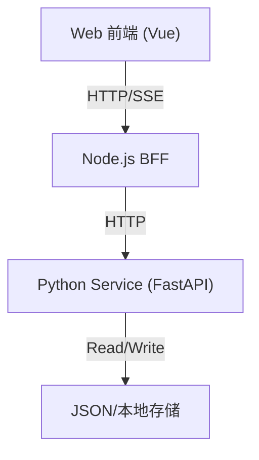

# 功能开发与模块集成状态

> **Last Updated**: 2026-01-21  
> **依据文件**: INTEGRATION_STATUS_AND_PROTOCOL.md, TODO_FRONTEND_BACKEND_GAP.md

## 1. 状态总览

| 模块 | 状态 | 说明 |
| :--- | :--- | :--- |
| **聊天/会话** | ✅ 已集成 | SSE 流式对话打通，切页后台流保持。 |
| **提示词管理** | ✅ 已集成 | Node 代理 `/prompts`，与 `prompts.json` 同步。 |
| **知识库(RAG)** | ✅ 已集成 | UI、BFF、Python 端全链路联通，支持上传/向量检索。 |
| **子代理** | ✅ 已集成 | `subagents.json` 动态加载，前后端 CRUD 可用。 |
| **工具/技能** | ✅ 已集成 | `/api/v1/tools` 可用，前端展示已对接。 |
| **Plan Graph** | ⚠️ 待完善 | 可视化仅反映历史消息，未接入 LangGraph 实时状态。 |
| **会话持久化** | ⚠️ 待完善 | Python 内存会话重启丢失，需要持久化存储。 |

## 2. 交互映射

## 3. 接口协议对照

| 功能 | 前端路由 | Node 处理文件 | Python 端点 | Python 函数 | 数据文件 |
| :--- | :--- | :--- | :--- | :--- | :--- |
| **提示词列表** | `GET /api/v1/chat/prompts` | `routes/chat.ts` | `GET /prompts` | `get_prompts` | `prompts.json` |
| **模板管理** | `GET/POST /api/v1/prompts/templates` | `routes/prompts.ts` | `GET/POST /prompts` | `get_prompts` / `update_prompts` | `prompts.json` |
| **会话配置** | `GET/POST /api/v1/chat/sessions/:id/config` | `routes/chat.ts` | `GET/POST /sessions/{id}/config` | `get_session_config` | 内存 |
| **聊天流** | `GET /api/v1/chat/sessions/:id/stream` | `pythonClient.ts` | `GET /sessions/{id}/stream` | `stream_session` | 内存 |
| **KB 源管理** | `GET/POST /api/v1/kb/sources` | `routes/kb.ts` | `GET/POST /kb/sources` | `get_kb_sources` | `kb_sources.json` |
| **KB 检索** | `POST /api/v1/kb/query` | `routes/kb.ts` | `POST /kb/query` | `perform_search` | 向量库 |
| **子代理管理** | `GET/POST /api/v1/agents/subagents` | `routes/agents.ts` | `GET/POST /agents/subagents` | `get_subagents` | `subagents.json` |
| **工具列表** | `GET /api/v1/tools` | `routes/tools.ts` | `GET /skills` | `list_skills` | deepagents_cli |

## 4. 已完成关键改进

1. **后台流式对话**：切换页面不影响 SSE 生成，提升长任务稳定性。
2. **RAG 全链路贯通**：上传、解析、向量检索、证据展示与可视化打通。
3. **模板与提示词统一**：模板与提示词共用后端存储与版本逻辑。
4. **子代理动态加载**：JSON 驱动的子代理集成已可用。

## 5. 风险与限制

1. **并发安全**：JSON 文件持久化在多线程下存在竞态风险。
2. **Plan Graph 可视化缺口**：未展示 LangGraph 实际运行状态。
3. **会话持久化缺失**：服务重启导致历史会话丢失。

## 6. 下一步优先方向

1. **Plan Graph 与 LangGraph 同步**：补齐实时执行状态与子代理拓扑。
2. **会话持久化**：引入 SQLite/PostgreSQL 持久化会话与配置。
3. **稳定性与可观测性**：增加连接状态、断线重连与错误可视化。
