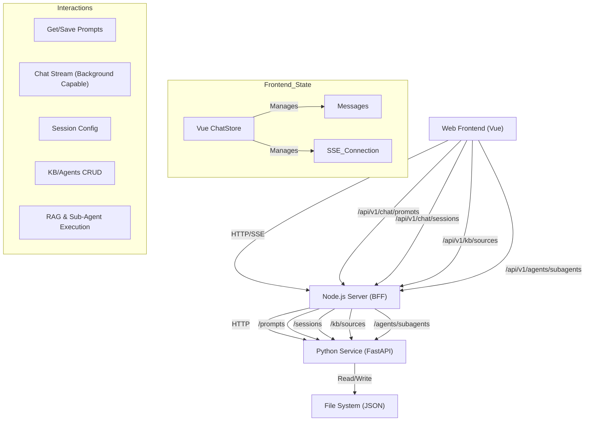

# Frontend-Backend Integration Status & Protocol Report

> **Last Updated**: 2026-01-11 (Verified End-to-End & Background Streaming)

## 1. Fix Status Overview

| Module | Status | Details |
| :--- | :--- | :--- |
| **Chat/Sessions** | ✅ Resolved | Full end-to-end integration. Messages stream via SSE. Config syncs with Python. **Background streaming supported** across tab switches. |
| **Prompts** | ✅ Resolved | Node.js proxies to Python (`/prompts`). Prompts persisted in `deepagents_data/prompts.json`. Node adapts versioning. |
| **Knowledge Base** | ⚠️ Partial | **Agent Side**: ✅ RAG Tool integrated & functional. **UI Side**: ⚠️ `KnowledgeBase.vue` currently uses mock data. Backend endpoints exist but are not connected to UI. Search API missing. |
| **Sub-Agents** | ✅ Resolved | API endpoints fully functional. **Dynamic Loading integrated**: Agent initializes with sub-agents from `subagents.json`. |
| **Tools/Skills** | ✅ Resolved | Frontend lists skills via `deepagents_cli` integration. |

## 2. Potential Risks & Limitations

1.  **Concurrency**: JSON file persistence in Python is not thread-safe.
2.  **RAG Implementation**: Current RAG (`rag_tool.py`) uses simple keyword search. For large datasets, VectorStore/Embeddings are recommended.
3.  **Version Logic**: Node.js adapter fabricates version history for Prompts.

## 3. Interaction Map

## 4. Interface Protocol & Mapping

| Feature | Frontend Route (Node) | Node Handler File | Python Endpoint | Python Function (app.py) | Data File |
| :--- | :--- | :--- | :--- | :--- | :--- |
| **List Prompts** | `GET /api/v1/chat/prompts` | `routes/chat.ts` | `GET /prompts` | `get_prompts` | `prompts.json` |
| **Manage Templates** | `GET/POST /api/v1/prompts/templates` | `routes/prompts.ts` | `GET/POST /prompts` | `get_prompts` / `update_prompts` | `prompts.json` |
| **Session Config** | `GET/POST /api/v1/chat/sessions/:id/config` | `routes/chat.ts` | `GET/POST /sessions/{id}/config` | `get_session_config` | In-Memory |
| **Chat Stream** | `GET /api/v1/chat/sessions/:id/stream` | `pythonClient.ts` | `GET /sessions/{id}/stream` | `stream_session` | In-Memory |
| **KB Sources** | `GET/POST /api/v1/kb/sources` | `routes/kb.ts` | `GET/POST /kb/sources` | `get_kb_sources` | `kb_sources.json` |
| **Sub-Agents** | `GET/POST /api/v1/agents/subagents` | `routes/agents.ts` | `GET/POST /agents/subagents` | `get_subagents` | `subagents.json` |
| **List Skills** | `GET /api/v1/tools` | `routes/tools.ts` | `GET /skills` | `list_skills` | `deepagents_cli` |

## 5. Completed Improvements (Recent)

1.  **Background Streaming**: Implemented centralized `chatStore` in Vue. Switching tabs (e.g., to Plan/Prompts) no longer terminates the conversation stream. The agent continues generating in the background.
2.  **Session Error Handling**: Added robust 404/502 handling in `RightPanel.vue` and `pythonClient.ts` to gracefully handle missing sessions or service restarts ("Failed to load session data" fix).
3.  **Markdown Rendering**: Improved `MarkdownRenderer.vue` to handle Blockquotes, Lists, and Horizontal Rules, and mitigates "div div" layout issues by handling raw HTML structures more safely.
4.  **RAG & Sub-Agents**: Integrated basic RAG tool and dynamic sub-agent loading from JSON files.

## 6. Next Steps (Future Roadmap)

1.  **Enhanced RAG**: Replace simple keyword search in `rag_tool.py` with a proper Vector Database (e.g., Chroma/FAISS) and Embeddings.
2.  **Database Integration**: Migrate from `json` files to SQLite/PostgreSQL for robust concurrency and data integrity.
3.  **Real-Time Agent Status**: Implement WebSocket or bidirectional SSE to push agent thought process/status updates to the frontend "Execution Plan" view more granularly.
4.  **Security**: Add authentication layer (currently bypassing auth for local dev).
5.  **UI Refinement**: Add a visual "Connection Status" indicator to inform the user if the Python/Node backend is disconnected.

## 7. Knowledge Base Integration Detail & Plan

Current status: The Backend (Python) and Node.js BFF have endpoints for KB Source management (`/kb/sources`), but the Frontend (`KnowledgeBase.vue`) is currently using mock data and does not connect to these endpoints. Additionally, the "Search/Test Retrieval" feature in the UI has no corresponding API.

### 7.1 Architecture Mapping

| Layer | File/Component | Current State | Target State |
| :--- | :--- | :--- | :--- |
| **Frontend UI** | `apps/web/src/views/KnowledgeBase.vue` | Uses `const sources = ref([...mock...])` | Fetch from `/api/v1/kb/sources` on mount. |
| **Frontend API** | `axios` calls in Vue | `axios.get('/api/v1/kb/query')` (404) | Implement correct API calls for CRUD and Search. |
| **BFF Route** | `apps/server/src/routes/kb.ts` | Has `GET/POST /sources`. Missing `/query`. | Add `POST /query` endpoint to proxy search requests. |
| **BFF Client** | `apps/server/src/pythonClient.ts` | Has `getKBSources`, `saveKBSource`. | Add `queryKnowledgeBase` function. |
| **Python API** | `services/python/app.py` | Has `GET/POST /kb/sources`. Missing `/kb/query`. | Add `POST /kb/query` endpoint. |
| **Python Logic** | `services/python/rag_tool.py` | Contains search logic inside `@tool` decorator. | Refactor search logic to be reusable by both Tool and API. |

### 7.2 Implementation Steps

#### Step 1: Python Service (`services/python`)
1.  **Refactor `rag_tool.py`**: Extract the core search logic (loading JSON, reading files, keyword matching) into a standalone function `perform_search(query: str) -> List[Dict]`.
2.  **Update `rag_tool.py`**: Make the `@tool` function call `perform_search`.
3.  **Update `app.py`**: Import `perform_search`. Add `POST /kb/query` endpoint that accepts `{ query: str }` and returns search results.

#### Step 2: Node.js BFF (`apps/server`)
1.  **Update `pythonClient.ts`**: Add `searchKnowledgeBase(query: string)` method calling `${PY_URL}/kb/query`.
2.  **Update `routes/kb.ts`**: Add `POST /query` route that calls `pythonClient.searchKnowledgeBase`.

#### Step 3: Frontend (`apps/web`)
1.  **Update `KnowledgeBase.vue`**:
    *   **Remove Mock Data**: Delete hardcoded `sources` array.
    *   **Fetch Sources**: Add `onMounted` hook to call `axios.get('/api/v1/kb/sources')`.
    *   **Connect Add Source**: Update `addSource` to `axios.post('/api/v1/kb/sources', newSource)`.
    *   **Connect Search**: Update `search` function to `axios.post('/api/v1/kb/query', { query })`.
    *   **Data Mapping**: Ensure frontend `Source` and `Record` interfaces match backend JSON structure.

## 8. Current Mock Implementation & Development Tasks

This section details all areas in the Frontend (`apps/web`) and BFF (`apps/server`) that currently use mock data, stubs, or hardcoded values, and outlines the tasks required to connect them to the real Backend (`services/python`).

### 8.1 Mock Inventory

| Component / Module | Mock Type | Description | File Location |
| :--- | :--- | :--- | :--- |
| **Knowledge Base UI** | ✅ **Resolved** | Connected to `/api/v1/kb/sources` and `/api/v1/kb/query`. Mocks removed. | `apps/web/src/views/KnowledgeBase.vue` |
| **Skills / Tools UI** | ✅ **Resolved** | Connected to `/api/v1/tools`. Hardcoded fallbacks removed. | `apps/web/src/views/SkillsView.vue` |
| **Prompt Templates** | ✅ **Resolved** | Connected to `/api/v1/prompts/templates`. | `apps/web/src/components/chat/Composer.vue` |
| **Quick Starters** | ✅ **Resolved** | Dynamic loading from `/api/v1/prompts/quick-starters`. Configurable via `quick_starters.json`. | `apps/web/src/views/ChatView.vue` |
| **Tool Execution** | **API Stub** | `POST /api/v1/tools/execute` in Node.js is a stub returning `null`. (Note: Tools are primarily executed by the Python Agent, so this might be intended). | `apps/server/src/routes/tools.ts` |

### 8.2 Development Tasks (Todos)

#### Knowledge Base Integration
- [x] **Backend**: Implement `perform_search` logic in `rag_tool.py` and expose via `POST /kb/query` in `app.py`.
- [x] **BFF**: Add `searchKnowledgeBase` to `pythonClient.ts` and `POST /query` route in `routes/kb.ts`.
- [x] **Frontend**: In `KnowledgeBase.vue`, replace mock `sources` with `onMounted` fetch from `/api/v1/kb/sources`.
- [x] **Frontend**: In `KnowledgeBase.vue`, connect `addSource` to `POST /api/v1/kb/sources`.
- [x] **Frontend**: In `KnowledgeBase.vue`, connect `search` function to `POST /api/v1/kb/query`.

#### Prompt Templates Integration
- [x] **Backend**: Verify or Add endpoint `GET /prompts/templates` in `app.py` (or reuse `/prompts` with a type filter).
- [x] **Frontend**: In `Composer.vue`, remove hardcoded `templates` array.
- [x] **Frontend**: Fetch available templates from backend on mount (or via `promptStore`) and populate the template selector.

#### Skills / Tools Refinement
- [x] **Frontend**: In `SkillsView.vue`, remove hardcoded fallback skills. Ensure UI handles "Empty State" or "Error State" gracefully if backend returns no skills.
- [x] **Verification**: Confirm `GET /api/v1/tools` returns the actual list of tools available to the CLI agent. (Verified: Returns 200 OK with list, currently empty `[]` which matches no installed skills).

#### Quick Starters (Optional/Enhancement)
- [x] **Frontend/Config**: Move "Quick Start" prompts from `ChatView.vue` to a configuration file (e.g., `prompts.json` or a new `ui_config.json`) served by the backend, allowing dynamic updates without code changes.
