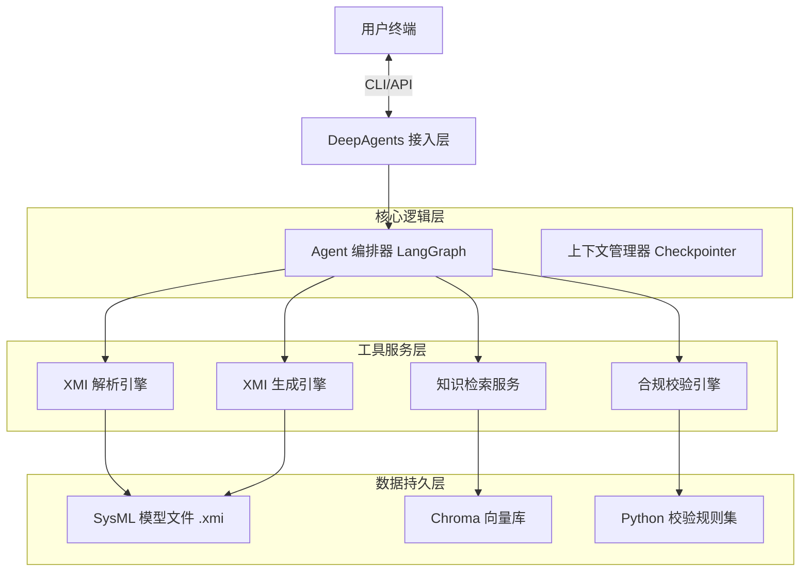
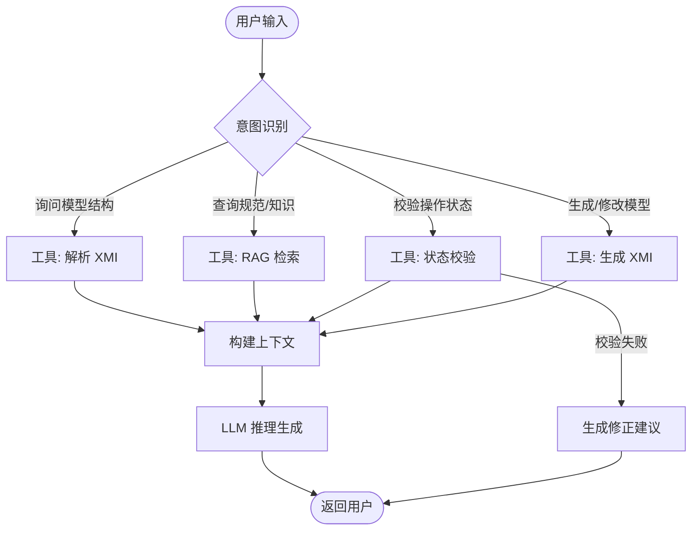
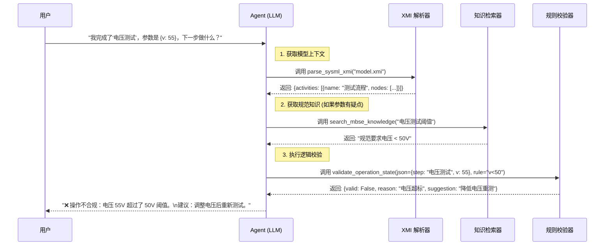
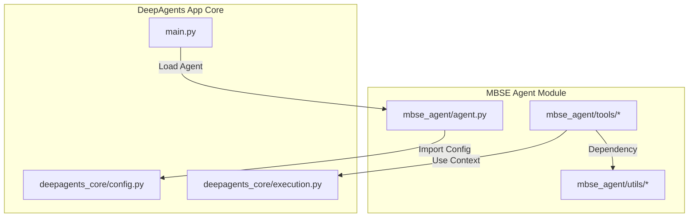

# MBSE 智能体助手详细技术规格说明书

本文档旨在通过详细的技术细节描述，使开发者能够在 15 分钟内理解 MBSE 智能体的完整实现逻辑。

## 1. 技术架构与选型

### 1.1 核心技术栈
*   **Agent 框架**: `deepagents` (基于 LangGraph 构建图式 Agent)
*   **LLM 模型**: 
    *   **在线**: DeepSeek-V3 (SiliconFlow)
    *   **离线**: Qwen2.5-72B / Llama-3 (vLLM 本地部署)
*   **XML 处理**: `lxml` (纯 Python/C 本地库，无网络依赖)
*   **向量检索 (RAG)**: 
    *   **向量库**: `langchain-chroma` (本地文件存储)
    *   **Embedding**: `HuggingFaceEmbeddings` (加载本地模型权重，如 BGE-M3)
*   **数据校验**: `pydantic` v2 (本地逻辑校验)

### 1.2 系统分层架构



## 2. 核心数据模型 (Intermediate Representation)

为了解耦复杂的 XML 格式与 Agent 的推理逻辑，我们定义一套中间 JSON 数据格式 (IR)。Agent 内部交互均基于此 IR。

### 2.1 SysML 模型结构 (Model Schema)
这是解析器 `parse_sysml_xmi` 的输出格式，也是 Agent 理解模型的基石。

```python
# utils/schemas.py
class SysMLNode(BaseModel):
    id: str
    name: str
    type: str  # e.g., "Block", "Action", "InitialNode"

class SysMLActivity(BaseModel):
    id: str
    name: str
    nodes: List[SysMLNode]
    edges: List[Dict[str, str]]  # {"source": "id1", "target": "id2"}

class SysMLModel(BaseModel):
    name: str
    blocks: List[SysMLNode]
    activities: List[SysMLActivity]
```

### 2.2 用户操作状态 (Operation State Schema)
这是 `validate_operation_state` 工具的输入格式，描述用户当前的业务上下文。

```python
class OperationContext(BaseModel):
    process_id: str          # 关联的 SysML Activity ID
    current_step_name: str   # 当前所在的节点名称
    parameters: Dict[str, Any] # 过程参数，如 {"voltage": 12.5}
    history: List[str]       # 已完成步骤 ID 列表
```

## 3. 详细模块实现方案

### 3.1 XMI 读写引擎 (`tools/xml_handler.py` & `tools/generator.py`)

#### 3.1.1 解析逻辑 (Reader)
**技术痛点**: XMI 文件充斥着复杂的命名空间 (Namespace) 和 ID 引用 (xmi:id / xmi:idref)，标准库难以处理。

**实现策略**:
1.  **命名空间映射**: 定义全局 `NS_MAP`，用于 XPath 查询。
2.  **元素定位**: 使用 `lxml` 的 XPath 功能精准抓取。
3.  **引用解析**: 建立 `id_to_element` 索引，将图结构的 `xmi:idref` 转换为直接的对象关联。

```python
# tools/xml_handler.py
from lxml import etree

NS_MAP = {
    'uml': 'http://www.eclipse.org/uml2/5.0.0/UML',
    'xmi': 'http://www.omg.org/spec/XMI/2.1',
    'sysml': 'http://www.omg.org/spec/SysML/20100301/SysML-profile'
}

def parse_sysml_xmi(file_path: str) -> dict:
    """
    解析 XMI 文件，提取 Block 和 Activity 信息
    """
    tree = etree.parse(file_path)
    root = tree.getroot()
    
    # 1. 抓取所有 Block (Class)
    blocks = []
    # 使用 XPath 定位带有 uml:Class 类型的 packagedElement
    for elem in root.xpath('//packagedElement[@xmi:type="uml:Class"]', namespaces=NS_MAP):
        # 提取 xmi:id (注意命名空间处理)
        xmi_id = elem.get(f"{{{NS_MAP['xmi']}}}id")
        blocks.append({
            "id": xmi_id,
            "name": elem.get("name"),
            "type": "Block",
            "properties": [
                # 提取子属性
                {"name": p.get("name"), "type_ref": p.xpath("type/@xmi:idref", namespaces=NS_MAP)[0]}
                for p in elem.xpath('ownedAttribute[@xmi:type="uml:Property"]', namespaces=NS_MAP)
                if p.xpath("type/@xmi:idref", namespaces=NS_MAP)
            ]
        })
        
    return {"blocks": blocks}
```

#### 3.1.2 生成逻辑 (Writer)
**技术挑战**: 直接拼接 XML 字符串极易导致语法错误或 ID 冲突，且难以维护复杂的 SysML 结构。

**实现策略**: 采用 **Jinja2 模板引擎** + **UUID 生成** 策略。
1.  **模板定义**: 预定义标准的 SysML 元素模板 (如 `block.xml.j2`, `activity.xml.j2`)。
    ```xml
    <!-- templates/block.xml.j2 -->
    <packagedElement xmi:type="uml:Class" xmi:id="{{ uid }}" name="{{ name }}">
      
      <ownedAttribute xmi:type="uml:Property" xmi:id="{{ prop.uid }}" name="{{ prop.name }}" visibility="public">
        <type xmi:idref="{{ prop.type_id }}"/>
      </ownedAttribute>
      
    </packagedElement>
    ```
2.  **动态渲染**: Agent 提取用户意图中的关键参数 (Name, Properties)，注入模板生成片段。
3.  **结构组装**: 将生成的片段插入到主模型的 `<uml:Model>` 节点下，并自动维护 `xmi:id` 的唯一性。

```python
# tools/generator.py
import uuid
import os
from jinja2 import Environment, FileSystemLoader

def generate_sysml_xmi(block_name: str, properties: list, output_dir: str = "output"):
    """
    基于模板生成 SysML Block 片段
    """
    # 初始化 Jinja2 环境
    env = Environment(loader=FileSystemLoader("data/sysml_templates"))
    template = env.get_template("block.xml.j2")
    
    # 准备数据上下文，自动生成 UUID
    context = {
        "uid": str(uuid.uuid4()),
        "name": block_name,
        "properties": [
            {
                "uid": str(uuid.uuid4()), 
                "name": p["name"], 
                "type_id": p.get("type_id", "PrimitiveTypes_String")
            } 
            for p in properties
        ]
    }
    
    # 渲染 XML 内容
    xml_content = template.render(**context)
    
    # 保存文件 (实际工程中应插入主 Model 文件)
    os.makedirs(output_dir, exist_ok=True)
    file_path = os.path.join(output_dir, f"{block_name}.xmi")
    with open(file_path, "w", encoding="utf-8") as f:
        f.write(xml_content)
        
    return file_path
```


### 3.2 RAG 知识库构建 (`tools/rag.py`)

**实现细节**:
1.  **文档切片**: 针对 SysML 规范 PDF/Markdown，按 "章节" 切分 (Chunk Size: 1000 tokens, Overlap: 200)，保证语义完整性。
2.  **检索增强**:
    *   **Metadata**: 每个 Chunk 增加 `{"chapter": "9. Blocks", "type": "specification"}`。
    *   **MMR 检索**: 使用 `Maximal Marginal Relevance` 算法，在保证相关性的同时增加结果多样性，避免 Agent 获取重复信息。

### 3.3 合规校验与流程辅助引擎 (`tools/validator.py`)

本模块同时承担 **合规检查** (Compliance) 和 **流程辅助** (Process Guidance) 两大职责。

**核心逻辑**: 基于有限状态机 (FSM) 的确定性校验。

1.  **拓扑加载 (Graph Builder)**: 
    从解析后的 IR 数据 (`SysMLActivity`) 中构建 `networkx.DiGraph` 有向图对象。
    *   Nodes: 步骤/动作 (Action)
    *   Edges: 控制流 (ControlFlow)

2.  **流程辅助 (Next Step Suggestion)**:
    *   **定位**: 根据用户输入的 `current_step_name` 在图中找到对应节点。
    *   **预测**: 获取该节点的所有出边 (Out-Edges) 指向的目标节点。
    *   **分支判断**: 如果存在多个后续步骤（如决策节点 Decision Node），分析边的 `guard` 条件，结合用户输入的 `parameters` 推荐最佳路径。
    *   **返回**: 推荐列表 `["Step B", "Step C (条件: v>50)"]`。

3.  **合规性分析 (Compliance Check)**:
    *   **连通性检查**: 验证 `history` 中的步骤是否在图中构成一条连通路径 (Path Connectivity)，防止用户跳步操作。
    *   **前置条件**: 检查 `current_step` 是否是 `history` 最后一个节点的直接后继。
    *   **参数约束**:
        *   读取 XMI 中定义的 `ConstraintBlock` (约束块)。
        *   使用 Python `eval` (安全沙箱内) 或简单的逻辑判断校验 `parameters` 是否满足约束 (e.g., `voltage < 50`)。

```python
# tools/validator.py
import networkx as nx
from typing import List, Dict, Any

class ComplianceEngine:
    def __init__(self, activities_data: List[Dict]):
        """
        初始化流程引擎，构建有向图
        """
        self.graph = nx.DiGraph()
        for act in activities_data:
            # 添加节点
            for node in act['nodes']:
                self.graph.add_node(node['id'], **node)
            # 添加边
            for edge in act['edges']:
                self.graph.add_edge(edge['source'], edge['target'], guard=edge.get('guard'))
    
    def validate_operation_state(self, current_step_name: str, parameters: Dict[str, Any]) -> Dict:
        """
        核心方法：校验当前状态并推荐下一步
        """
        # 1. 定位当前节点
        current_nodes = [n for n, d in self.graph.nodes(data=True) if d.get('name') == current_step_name]
        if not current_nodes:
            return {"valid": False, "reason": f"流程中未找到步骤 '{current_step_name}'"}
            
        curr_id = current_nodes[0]
        
        # 2. 合规性检查 (示例：检查参数约束)
        # 实际项目中应解析 ConstraintBlock
        if current_step_name == "电压测试" and parameters.get("voltage", 0) > 50:
             return {
                 "valid": False, 
                 "reason": "违反约束: 电压必须 <= 50V",
                 "suggestion": "请调整电压参数后重试"
             }

        # 3. 预测下一步
        next_steps = []
        for successor in self.graph.successors(curr_id):
            edge_data = self.graph.get_edge_data(curr_id, successor)
            target_node = self.graph.nodes[successor]
            
            # 处理分支条件
            guard = edge_data.get('guard')
            if guard:
                next_steps.append(f"{target_node['name']} (需满足: {guard})")
            else:
                next_steps.append(target_node['name'])
                
        return {
            "valid": True,
            "current_node": current_step_name,
            "next_steps": next_steps
        }
```

### 3.4 Agent 编排 (`agent.py`)

**System Prompt 设计**: 采用 "角色-能力-约束-思维链" 四维结构，确保 Agent 在处理复杂任务时不偏离轨道。

```python
SYSTEM_PROMPT = """
【角色】
你是由 DeepAgents 驱动的 MBSE 专家助手。你精通 SysML v1.0 规范，拥有读取、生成、校验 SysML 模型文件及提供流程辅助的能力。

【核心能力与工具使用规范】
1. **模型解析 (XMI Parsing)**
   - 遇到"分析模型"、"读取流程"请求时，**必须**首先调用 `parse_sysml_xmi`。
   - 不要尝试直接阅读 XML 源码，必须依赖解析工具返回的 JSON 结构。

2. **模型生成 (XMI Generation)**
   - 遇到"创建模型"、"生成 Block"请求时，**必须**调用 `generate_sysml_xmi`。
   - 在调用前，通过对话确认关键参数（如 Block 名称、属性列表）。不要凭空猜测。

3. **合规校验与流程辅助 (Compliance & Guidance)**
   - 当用户提供操作状态（JSON 格式或自然语言描述当前步骤与参数）时，**必须**调用 `validate_operation_state`。
   - 根据工具返回的 `valid` 字段判断：
     - 若 `False`：严厉指出错误原因，并引用规范条款。
     - 若 `True`：给予肯定，并根据工具返回的 `next_steps` 建议下一步操作。

4. **规范查询 (Knowledge Retrieval)**
   - 遇到不确定的 SysML 语法或流程规则，使用 `search_mbse_knowledge`。

【思维链 (Chain of Thought)】
在回答用户前，请按以下步骤思考：
1. **意图识别**: 用户是想看模型(Parse)、改模型(Generate)、查规范(RAG)还是做任务(Validate)？
2. **信息核对**: 缺少必要参数吗？(如生成模型缺属性，校验状态缺参数)。缺则追问。
3. **工具调用**: 选择最合适的工具执行。
4. **结果综合**: 将工具返回的结构化数据转换为自然语言建议。

【约束】
- 严禁臆造模型中不存在的 Block 或 Flow。
- 如果校验失败，必须明确指出违反了哪条规则（引用工具返回的 Error Message）。
- 涉及生成文件操作时，必须告知用户文件保存路径。
"""
```

### 3.5 模型服务接入层 (Model Serving Layer)

为了兼顾**公有云的高性能**与**私有环境的数据安全**，系统采用标准 OpenAI 协议接口，支持无缝切换后端推理引擎。

#### 3.5.1 SiliconFlow 云端接入方案 (推荐)
适用于开发测试及对数据隐私不敏感的场景，可低成本调用 DeepSeek-V3 等 SOTA 模型。

*   **Chat Model 配置**:
    ```python
    from langchain_openai import ChatOpenAI
    
    llm = ChatOpenAI(
        base_url="https://api.siliconflow.cn/v1",
        api_key="sk-...",  # 从环境变量获取
        model="deepseek-ai/DeepSeek-V3",  # 或 deepseek-ai/DeepSeek-R1
        temperature=0.1  # MBSE 任务需要低创造性、高精确度
    )
    ```

*   **Embedding 配置 (RAG 核心)**:
    SiliconFlow 提供兼容 OpenAI 格式的 Embedding 接口，推荐使用 BGE 系列模型以获得更好的中文语义理解。
    ```python
    from langchain_openai import OpenAIEmbeddings
    
    embeddings = OpenAIEmbeddings(
        base_url="https://api.siliconflow.cn/v1",
        api_key="sk-...",
        model="BAAI/bge-m3",  # 支持多语言、长文本的高性能 Embedding
        check_embedding_ctx_length=False
    )
    ```

#### 3.5.2 本地 vLLM 私有化部署方案 (完全离线)
适用于企业内网环境，数据不出域，无需互联网连接。

1.  **准备工作 (Resource Preparation)**:
    *   **下载模型权重**: 在有网环境下载 `Qwen/Qwen2.5-72B-Instruct` 和 `BAAI/bge-m3` 权重文件，传输至离线服务器目录（如 `/data/models/`）。
    *   **安装依赖**: 离线安装 `vllm`, `langchain-huggingface`, `sentence-transformers` 等 Python 包。

2.  **推理服务启动 (Server Side)**:
    使用 vLLM 加载本地模型路径启动 API 服务。
    ```bash
    # 假设模型权重位于 /data/models/Qwen2.5-72B-Instruct
    vllm serve /data/models/Qwen2.5-72B-Instruct \
      --host 0.0.0.0 \
      --port 8000 \
      --served-model-name local-qwen \
      --gpu-memory-utilization 0.90 \
      --max-model-len 32768
    ```

3.  **智能体接入 (Client Side)**:
    Agent 代码配置指向本地服务和本地 Embedding 模型。
    ```python
    # agent.py / config.py
    
    # 1. 离线推理模型 (连接本地 vLLM)
    llm_local = ChatOpenAI(
        base_url="http://localhost:8000/v1",
        api_key="sk-dummy", # 本地模式任意填写
        model="local-qwen",
        temperature=0.1
    )
    
    # 2. 离线 Embedding 模型 (直接加载本地权重)
    from langchain_huggingface import HuggingFaceEmbeddings
    
    embed_local = HuggingFaceEmbeddings(
        model_name="/data/models/bge-m3", # 指向本地绝对路径
        model_kwargs={'device': 'cuda'},  # 使用 GPU 加速
        encode_kwargs={'normalize_embeddings': True}
    )
    
    # 3. 离线向量库 (本地文件持久化)
    from langchain_chroma import Chroma
    vector_db = Chroma(
        persist_directory="/data/mbse_knowledge_db",
        embedding_function=embed_local
    )
    ```

通过上述配置，MBSE 智能体的**四大核心功能**（XMI 生成、XMI 解析、流程辅助、合规校验）均可在**物理隔离**的网络环境中稳定运行。解析与校验逻辑（`lxml`, `pydantic`）本质为本地 Python 代码，天然支持离线。

### 3.6 异常处理与鲁棒性设计 (Robustness Design)

为确保系统在工程环境下的稳定运行，必须处理以下关键异常场景。

1.  **XMI 解析失败**:
    *   **场景**: 用户上传了损坏的 XML 或不兼容的版本。
    *   **对策**: `parse_sysml_xmi` 捕获 `lxml.etree.XMLSyntaxError`，返回友好的错误提示 `"文件格式错误: 行 X 列 Y，请检查是否为有效的 SysML v1.0 XMI"`，而不是直接抛出 Traceback。

2.  **LLM 幻觉控制**:
    *   **场景**: LLM 编造了不存在的规范条款。
    *   **对策**: 强制 RAG 工具返回 `source_document` 引用。Agent 回答时必须附带 `"根据 [SysML规范 9.1节]..."`。若检索结果为空，LLM 应回答 `"知识库中未找到相关规定"`，禁止瞎编。

3.  **合规校验死锁**:
    *   **场景**: 用户陷入死循环或无法满足的约束条件。
    *   **对策**: `validate_operation_state` 检测到连续 3 次校验失败时，自动触发 **"降级模式"**，提示用户 `"检测到您卡在当前步骤，是否需要联系人工专家或查看该步骤的操作手册？"`。

4.  **离线环境降级**:
    *   **场景**: 向量库文件丢失或加载失败。
    *   **对策**: 系统启动时检查 `persist_directory`。若不可用，自动禁用 RAG 功能，仅保留基于规则的逻辑校验，并在日志中输出警告。

### 3.7 知识库构建与维护流程 (Knowledge Pipeline)

RAG 的核心在于数据的质量。为了构建稳定可靠的知识库，我们需要独立的**数据入库流水线 (Ingestion Pipeline)**。

1.  **数据源准备 (Data Sourcing)**:
    *   将 SysML v1.0 规范 PDF、企业内部建模规范 Word/Markdown、最佳实践案例 XMI 放置于 `data/raw_knowledge/` 目录。

2.  **入库脚本 (`scripts/build_knowledge.py`)**:
    该脚本负责将非结构化文档转换为向量库索引。
    *   **Loader**: 使用 `PyPDFLoader` 或 `UnstructuredMarkdownLoader` 加载文档。
    *   **Splitter**: 使用 `RecursiveCharacterTextSplitter` 进行语义切分 (Chunk Size: 1000, Overlap: 200)。
    *   **Embedding**: 调用本地或云端 Embedding 模型将文本向量化。
    *   **Persist**: 将向量索引保存至 `data/vector_db/` (ChromaDB)。

    ```python
    # scripts/build_knowledge.py
    import os
    from langchain_community.document_loaders import PyPDFLoader, UnstructuredMarkdownLoader
    from langchain_text_splitters import RecursiveCharacterTextSplitter
    from langchain_chroma import Chroma
    from langchain_huggingface import HuggingFaceEmbeddings

    def build_index():
        # 1. Loader: 遍历目录加载文档
        docs = []
        raw_dir = "data/raw_knowledge/"
        # 确保目录存在
        os.makedirs(raw_dir, exist_ok=True)
        
        for filename in os.listdir(raw_dir):
            path = os.path.join(raw_dir, filename)
            if filename.endswith(".pdf"):
                docs.extend(PyPDFLoader(path).load())
            elif filename.endswith(".md"):
                docs.extend(UnstructuredMarkdownLoader(path).load())
        
        if not docs:
            print("未找到文档，请在 data/raw_knowledge/ 下放置 .pdf 或 .md 文件")
            return

        # 2. Splitter: 语义切分
        text_splitter = RecursiveCharacterTextSplitter(chunk_size=1000, chunk_overlap=200)
        chunks = text_splitter.split_documents(docs)

        # 3. Embedding: 初始化模型
        # 注意: 实际使用需配置 model_name 指向本地路径或 HuggingFace Hub ID
        embedding_model = HuggingFaceEmbeddings(
            model_name="BAAI/bge-m3",
            model_kwargs={'device': 'cpu'}, # 有 GPU 可设为 'cuda'
            encode_kwargs={'normalize_embeddings': True}
        )
        
        # 4. Persist: 向量化并持久化存储
        vector_db = Chroma.from_documents(
            documents=chunks,
            embedding=embedding_model,
            persist_directory="data/vector_db"
        )
        print(f"成功索引 {len(chunks)} 个知识片段到 data/vector_db")

    if __name__ == "__main__":
        build_index()
    ```

3.  **增量更新策略**:
    *   定期运行构建脚本。
    *   脚本应支持 Hash 校验，仅处理新增或修改的文档，避免重复索引。

## 4. 业务流程与交互设计

### 4.1 核心业务逻辑流 (Flowchart)

展示 Agent 处理用户请求的内部决策逻辑。



### 4.2 业务交互时序图 (Sequence Diagram)

展示一个完整的 "用户提交状态 -> 校验 -> 推荐" 的闭环。



## 5. 工程集成与文件布局

为了将 MBSE 智能体无缝集成到 `deepagents-app` 工程中，我们采用模块化插件的设计模式。

### 5.1 新增文件布局 (File Structure)

建议将 MBSE 智能体核心逻辑封装为独立的子模块 `mbse_agent`，置于 `deepagents_core` 目录下。

```text
libs/deepagents-app/deepagents_core/mbse_agent/
├── __init__.py           # 暴露核心工具与 Agent 工厂函数
├── agent.py              # Agent 编排逻辑 (LangGraph 定义)
├── config.py             # MBSE 专用配置 (加载 deepagents_core.config)
├── tools/                # 自定义工具集
│   ├── __init__.py       # 导出工具列表
│   ├── generator.py      # XMI 生成工具 (generate_sysml_xmi)
│   ├── parser.py         # XMI 解析工具 (parse_sysml_xmi)
│   ├── validator.py      # 合规校验工具 (validate_operation_state)
│   └── rag.py            # 知识检索工具 (search_mbse_knowledge)
├── utils/                # 辅助工具
│   ├── __init__.py
│   ├── schemas.py        # Pydantic 数据模型 (SysMLModel, OperationContext)
│   └── xml_helper.py     # lxml 命名空间处理与 XPath 封装
└── data/                 # 静态资源
    └── sysml_templates/  # XMI 生成模板
```

### 5.2 现有工程代码关联关系

MBSE 模块并非孤立存在，它深度依赖 `deepagents-app` 的基础设施。

#### 5.2.1 路径依赖关系
*   **配置复用**: `mbse_agent/config.py` 继承自 `libs/deepagents-app/deepagents_core/config.py`，复用系统级 API Key 管理和日志配置。
*   **沙箱环境**: 工具执行依赖 `libs/deepagents-app/deepagents_core/execution.py` 提供的执行上下文，确保文件读写在安全沙箱内进行。
*   **LLM 客户端**: `mbse_agent/agent.py` 使用 `deepagents` 框架提供的统一 LLM 接口，无需重复实例化客户端。

#### 5.2.2 调用关系图


### 5.3 集成步骤
1.  **创建目录**: 在 `libs/deepagents-app/deepagents_core/` 下新建 `mbse_agent` 文件夹。
2.  **注册 Agent**: 在 `libs/deepagents-app/deepagents_core/agent.py` 的 `list_agents` 或加载逻辑中添加对 MBSE Agent 的识别（或通过 `--agent mbse` 参数动态加载）。
3.  **依赖注入**: 确保 `mbse_agent` 的工具能够访问全局 `settings` 对象以获取 API Key。

## 7. 测试与验证策略 (Testing Strategy)

为了保证工程质量，必须执行以下三层测试。

### 7.1 单元测试 (Unit Tests)
针对核心工具函数的白盒测试。
*   **tests/test_parser.py**: 提供一个包含所有 SysML 元素类型的 `golden.xmi`，断言 `parse_sysml_xmi` 返回的 JSON 结构字段完整、值正确。
*   **tests/test_generator.py**: 输入 mock 参数调用 `generate_sysml_xmi`，验证生成的 XML 字符串能通过 `lxml` 的 Schema 校验。
*   **tests/test_validator.py**: 构建一个已知的 `networkx` 图，测试合法路径返回 `valid=True`，断路或违规参数返回 `valid=False`。

### 7.2 集成测试 (Integration Tests)
在沙箱环境中模拟 Agent 调用流程。
*   **场景**: "创建一个 Block A，然后查询它的属性"。
*   **验证点**:
    1.  Agent 正确调用了 `generate_sysml_xmi`。
    2.  文件系统中确实生成了 `.xmi` 文件。
    3.  Agent 随后的 `parse_sysml_xmi` 调用能正确读取到刚才生成的内容。

### 7.3 端到端验收测试 (E2E User Acceptance)
使用 CLI 进行黑盒测试 (Human-in-the-loop)。
*   **测试用例 1 (流程辅助)**:
    *   输入: "我正在进行需求分析步骤，当前状态是 {completed: 0%}"
    *   预期: Agent 识别出 "需求分析" 节点，提示 "下一步请定义顶层 UseCase"，并引用规范第 3 章。
*   **测试用例 2 (合规阻断)**:
    *   输入: "跳过测试阶段，直接发布产品"
    *   预期: Agent 警告 "违反流程约束：[测试阶段] 为必选节点，不可跳过"，并拒绝提供发布建议。

### 5.4 关键配置清单 (Configuration Specs)

为了支持工程化部署，以下配置项必须在 `config.yaml` 或环境变量中明确定义。

| 配置分类 | 环境变量 (ENV) | 配置文件 (`config.yaml`) | 说明 |
| :--- | :--- | :--- | :--- |
| **Model** | `OPENAI_API_BASE` | `llm.base_url` | 模型 API 端点 (SiliconFlow / vLLM) |
| | `OPENAI_API_KEY` | `llm.api_key` | API 密钥 (本地模式可随意填) |
| | `MODEL_NAME` | `llm.model_name` | 模型名称 (e.g., deepseek-ai/DeepSeek-V3) |
| **RAG** | `MBSE_KNOWLEDGE_DB` | `rag.db_path` | ChromaDB 本地持久化路径 (e.g., `/data/vector_db`) |
| | `EMBEDDING_MODEL_PATH` | `rag.embedding_path` | 本地 Embedding 模型路径 (离线模式必填) |
| **Resources**| `MBSE_TEMPLATE_DIR` | `resources.templates`| Jinja2 模板文件目录 |
| **Feature** | `ENABLE_COMPLIANCE_CHECK`| `feature.compliance` | 是否开启强制合规校验 (True/False) |

## 6. 快速开发路径 (15分钟上手)
    `pip install deepagents lxml pydantic langchain-chroma`
2.  **定义 Schema (3 min)**:
    复制 `2.1` 和 `2.2` 中的 Pydantic 类到 `utils/schemas.py`。
3.  **实现核心工具 (5 min)**:
    *   `tools/parser.py`: 使用 `lxml` 实现简单的 XMI 节点提取。
    *   `tools/validator.py`: 实现 "检查当前节点是否在图中" 的简单逻辑。
4.  **组装 Agent (3 min)**:
    使用 `create_deep_agent` 绑定上述工具，填入 System Prompt。
5.  **运行测试 (2 min)**:
    编写一个包含 `<uml:Class name="TestBlock"/>` 的最小 `test.xmi`，运行 CLI 验证对话。
