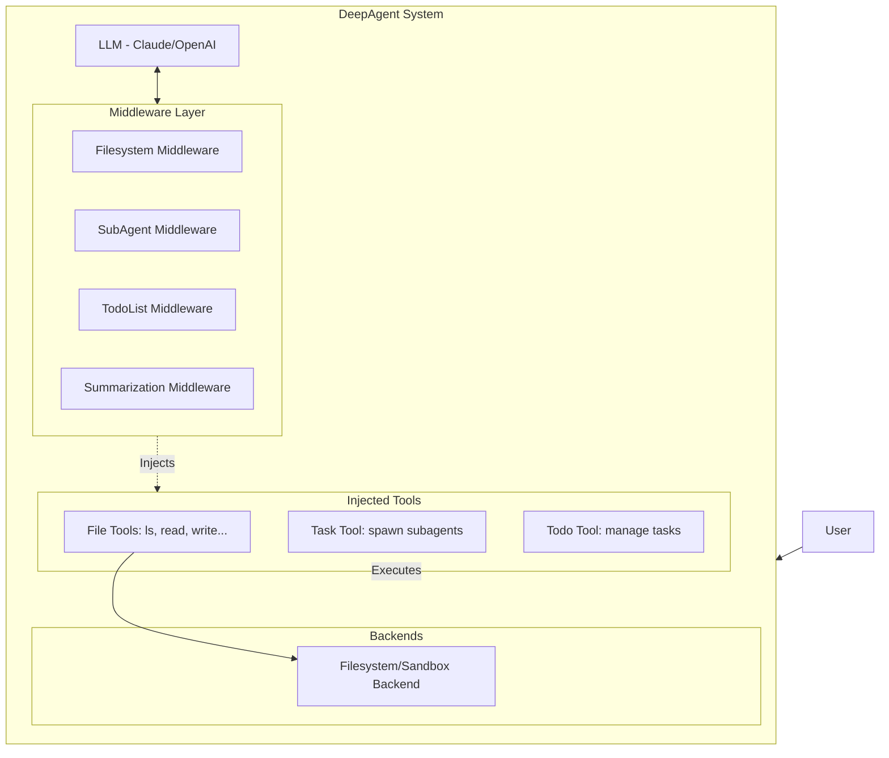
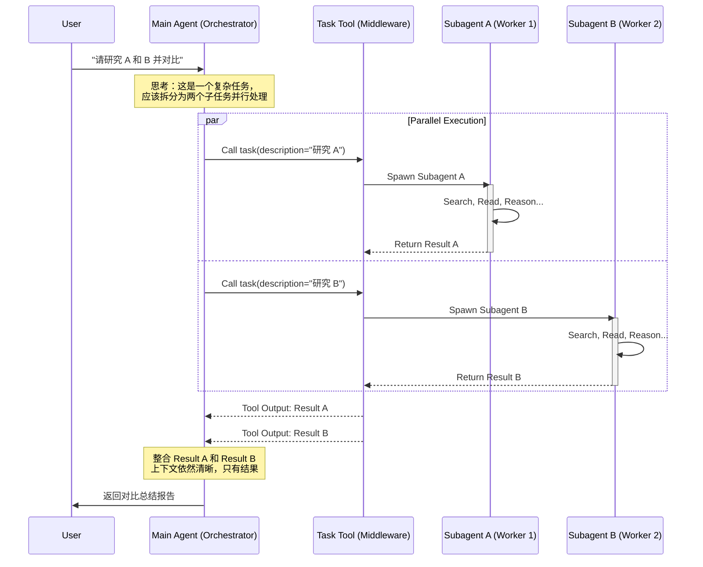

# DeepAgents 项目设计与 Subagents 机制说明文档

> **快速上手**: 如果你想直接运行项目，请查看 [快速启动指南 (QUICK_START.md)](QUICK_START.md)。

本文档旨在帮助开发者快速理解 DeepAgents 项目的核心设计，特别是其强大的 Subagents（子智能体）机制。

## 1. 项目概览

DeepAgents 是一个构建高级 AI 智能体的框架，它通过模块化的中间件（Middleware）架构，为智能体提供了丰富的能力，包括任务规划、文件系统操作、以及通过 Subagents 进行复杂任务分拆和执行的能力。

核心入口函数是 `create_deep_agent`，它组装了各种中间件来构建一个功能完备的智能体。

### 1.1 项目模块关系 (Module Relationships)

DeepAgents 项目由三个核心部分组成，它们共同构成了一个完整的开发、使用和评估生态系统。

*   **`deepagents` (Core Lib)**: 核心库。
    *   **定位**: 提供底层的 Agent 逻辑、中间件（Middleware）、工具集（Tools）和图构建（LangGraph）。
    *   **职责**: 定义了智能体"如何思考和行动"。包括 `SubAgentMiddleware`、`FilesystemMiddleware` 等核心逻辑都在这里实现。它是其他两个模块的基础依赖。

*   **`deepagents-cli` (Command Line Interface)**: 命令行工具。
    *   **定位**: 面向用户的终端交互程序。
    *   **职责**: 让用户可以在终端中直接与 `deepagents` 构建的智能体对话。它负责处理用户输入、加载配置（`agent.md`, skills）、渲染输出、管理会话记忆，并调用核心库来执行任务。相当于 Claude Code 的开源替代品。

*   **`harbor` (Evaluation Harness)**: 评估与测试套件。
    *   **定位**: 用于评估 Agent 能力的测试框架，对接 [Harbor](https://github.com/laude-institute/harbor) 评估平台。
    *   **职责**: 提供了一个标准化的环境（Sandbox），在其中运行 `deepagents` 并让其完成 [Terminal Bench 2.0](https://github.com/laude-institute/terminal-bench-2) 等基准测试任务。它帮助开发者量化智能体的表现，并利用 LangSmith 进行追踪和优化。

**关系图解**:

```mermaid
graph TD
    Core[deepagents <br/>(Core Logic & Middleware)]
    CLI[deepagents-cli <br/>(User Interface)]
    Harbor[harbor <br/>(Evaluation & Benchmarking)]
    
    CLI -->|Imports & Uses| Core
    Harbor -->|Wraps & Tests| Core
    
    User[Developer/User] -->|Interacts with| CLI
    Bench[Benchmarks <br/>e.g. Terminal Bench] -->|Evaluates| Harbor
```

### 1.2 项目功能架构图

下图展示了 DeepAgents 的核心组件关系。



## 2. 核心设计：中间件架构

DeepAgents 采用中间件模式来增强智能体的能力。当你创建一个 "Deep Agent" 时，它默认包含以下关键中间件：

*   **FilesystemMiddleware**: 赋予智能体操作文件系统的能力（如 `ls`, `read_file`, `write_file`, `edit_file`, `grep` 等）。这使得智能体可以像开发者一样浏览和修改代码库。
*   **TodoListMiddleware**: 允许智能体管理自己的任务清单，用于跟踪长任务的进度。
*   **SummarizationMiddleware**: 自动管理上下文窗口，当对话过长时进行总结，防止 Token 溢出。
*   **SubAgentMiddleware**: **这是本项目的核心亮点**，它允许智能体创建并调用子智能体来处理特定任务。

## 3. Subagents 机制详解

### 3.1 什么是 Subagents？

Subagents 是由主智能体（Main Agent）通过 `task` 工具调用的、**临时的（Ephemeral）**、**隔离的（Isolated）** 子智能体。

*   **临时性**：它们为了完成一个特定任务而生，任务完成后即销毁。
*   **隔离性**：它们拥有独立的上下文窗口（Context Window）。这意味着子智能体的繁琐思考过程、中间步骤和大量 Token 消耗不会污染主智能体的上下文。

### 3.2 为什么使用 Subagents？

1.  **上下文隔离（Context Isolation）**：
    *   主智能体不需要知道子智能体是如何一步步完成任务的，只需要最终结果。
    *   避免主线程被无关的细节（如中间的搜索结果、报错重试等）填满，保持主线程清晰。
2.  **并行处理（Parallelism）**：
    *   主智能体可以同时启动多个 Subagents 并行工作。例如，同时研究三个不同的主题，大大缩短总耗时。
3.  **专业化（Specialization）**：
    *   可以定义具有特定角色、工具集或系统提示词（System Prompt）的自定义 Subagents（如 "代码审查员"、"搜索专家"）。

### 3.3 工作流程 (Lifecycle)

Subagents 的生命周期分为四个阶段：

1.  **Spawn (孵化)**: 主智能体调用 `task` 工具，指定子智能体类型（如 `general-purpose`）和任务描述。
2.  **Run (运行)**: 子智能体在一个全新的环境中独立运行，自动规划并执行任务。
3.  **Return (返回)**: 子智能体完成任务后，向主智能体返回一个单一的、结构化的结果。
4.  **Reconcile (整合)**: 主智能体接收结果，并将其整合到自己的上下文中。

### 3.4 业务流程架构图 (Subagent Workflow)

下图详细展示了主智能体如何通过 `SubAgentMiddleware` 提供的 `task` 工具来孵化子智能体，并实现上下文隔离与结果回收的流程。



### 3.5 `task` 工具

`SubAgentMiddleware` 会向智能体注册一个名为 `task` 的工具。
*   **参数**:
    *   `description`: 详细的任务描述。
    *   `subagent_type`: 要使用的子智能体类型（默认为 `general-purpose`）。
*   **通用子智能体 (`general-purpose`)**: 这是一个默认提供的子智能体，拥有与主智能体相同的工具集，适用于大多数需要隔离上下文的复杂任务。

## 4. 技术实现深入解析 (Implementation Details)

为了帮助开发者深入理解，这里详细解释 Subagents 的实现逻辑。

### 4.1 核心实现逻辑

Subagents 机制主要通过 `SubAgentMiddleware` 类实现。它做了两件关键的事情：

1.  **注入 `task` 工具**: 在初始化时，它会编译所有定义的子智能体（包括 `general-purpose` 和自定义的），并将它们封装进一个名为 `task` 的 `StructuredTool` 中。这个工具被添加到主智能体的工具列表中。
2.  **注入 System Prompt**: 通过 `wrap_model_call` 方法，它向主智能体的 System Prompt 中追加了关于如何使用 `task` 工具的详细指南 (`TASK_SYSTEM_PROMPT`)，教导模型何时以及如何使用子智能体。

### 4.2 Subagents 状态管理代码示例

```python
# 状态隔离逻辑
subagent_state = {
    k: v for k, v in runtime.state.items() 
    if k not in _EXCLUDED_STATE_KEYS  # 排除 messages, todos 等上下文
}
# 注入新任务描述
subagent_state["messages"] = [HumanMessage(content=description)]
```

## 5. Skill System (技能系统)

DeepAgents 的核心设计哲学之一是**可扩展性**。Skill System 允许用户以模块化的方式为 Agent 注入专业知识、标准工作流（SOP）和定制工具，而无需修改核心代码。

### 5.1 核心设计：渐进式披露 (Progressive Disclosure)

为了避免 System Prompt 过长（Context Window 爆炸），DeepAgents 采用了**渐进式披露**机制：

1.  **注册阶段**: Agent 启动时，`SkillsMiddleware` 会扫描技能目录，只将所有 Skill 的 **名称 (Name)** 和 **简短描述 (Description)** 注入到 System Prompt 中。
2.  **触发阶段**: 当用户请求匹配某个 Skill 的描述时（例如 "帮我做一下竞品调研" 匹配到 `web-research` skill），Agent 会意识到需要使用该技能。
3.  **加载阶段**: Agent 主动调用 `read_file` 工具读取该 Skill 的核心文件 `SKILL.md`。
4.  **执行阶段**: Agent 根据 `SKILL.md` 中的详细步骤、脚本和引用文件执行任务。

### 5.2 Skill 的结构

一个 Skill 就是一个标准化的文件夹，通常包含：

*   **`SKILL.md` (必须)**: 核心指南。包含 Skill 的元数据（Frontmatter）、详细操作步骤、决策树和最佳实践。
*   **`scripts/` (可选)**: Python/Bash 脚本，封装复杂的逻辑，供 Agent 直接调用。
*   **`references/` (可选)**: 参考文档、API 规范、知识库。
*   **`assets/` (可选)**: 模板文件、示例数据。

**目录结构示例**:
```text
~/.deepagents/agent/skills/
└── web-research/
    ├── SKILL.md            # "大脑": 告诉 Agent 如何做研究
    ├── scripts/
    │   └── summarize.py    # "手": 辅助脚本
    └── references/
        └── sources.md      # "书": 推荐的信息源列表
```

### 5.3 Skill-Creator: 生产技能的技能

`skill-creator` 是 DeepAgents 中一个特殊的 **Meta-Skill**（元技能）。它的作用是指导用户（或 Agent 自身）创建新的 Skill。

**工作流程**:
1.  **需求分析**: 用户告诉 Agent "我想做一个处理 PDF 的技能"。
2.  **规划**: `skill-creator` 引导用户思考：需要哪些脚本？有哪些标准流程？
3.  **初始化**: 调用 `init_skill.py` 脚本，自动生成标准目录结构和模板。
4.  **填充**: 编写 `SKILL.md` 和具体的代码逻辑。
5.  **验证**: 运行测试确保 Skill 可用。

**CLI 命令支持**:
DeepAgents CLI 提供了原生命令来管理这一过程：
*   `deepagents skills list`: 查看已安装的技能。
*   `deepagents skills create <name>`: 快速创建一个新技能模板。

通过这种机制，DeepAgents 具备了**自我进化**的能力——它可以编写新的代码和文档来扩展自己的能力边界。

### 5.4 CLI 命令详解 (CLI Commands)

DeepAgents CLI (`deepagents-cli`) 提供了原生命令来管理 Skill 生命周期，帮助开发者快速构建和调试技能。

#### 1. 列出技能 (`list`)
```bash
deepagents skills list [--agent <agent>] [--project]
```
*   **功能**: 列出当前环境可用的所有 Skill。
*   **参数**:
    *   `--agent <name>`: 指定查看哪个 Agent 配置下的技能（默认: `agent`）。
    *   `--project`: 仅列出当前项目目录下的技能（Project-level skills）。

#### 2. 创建技能 (`create`)
```bash
deepagents skills create <name> [--agent <agent>] [--project]
```
*   **功能**: 使用标准模板初始化一个新的 Skill。
*   **参数**:
    *   `<name>`: 技能名称（必须仅包含小写字母、数字和连字符，如 `pdf-tools`）。
    *   `--project`: 在当前项目根目录下创建技能（适合特定项目的专用技能）。

#### 3. 查看技能详情 (`info`)
```bash
deepagents skills info <name> [--agent <agent>] [--project]
```
*   **功能**: 显示指定 Skill 的完整信息，包括存储路径、描述、辅助文件列表以及 `SKILL.md` 的完整内容。
*   **用途**: 快速检查技能文档是否正确加载，或阅读技能的具体指令。

**典型工作流示例**:
```bash
# 1. 检查现有技能
deepagents skills list

# 2. 创建新技能 "data-analysis"
deepagents skills create data-analysis

# 3. (编辑 SKILL.md 后) 验证内容
deepagents skills info data-analysis
```

### 5.5 技术实现深入解析 (Technical Implementation)

Skill 系统的魔力不在于复杂的代码逻辑，而在于**Prompt Engineering**与**文件系统**的优雅结合。

#### 1. 发现与加载机制 (Discovery & Loading)
DeepAgents 不会将所有 Skill 的内容一次性加载到内存。相反，它在启动时只扫描目录，提取元数据。

*   **双层加载策略**: 同时扫描用户目录 (`~/.deepagents/...`) 和项目目录 (`.deepagents/skills/`)。
*   **覆盖机制**: 同名的 Project Skill 会覆盖 User Skill，允许项目特定的行为定制。
*   **YAML Frontmatter**: 解析 `SKILL.md` 顶部的 YAML 块获取 `name` 和 `description`。

```python
# 代码片段: deepagents_cli/skills/load.py
def list_skills(*, user_skills_dir, project_skills_dir) -> list[SkillMetadata]:
    all_skills = {}
    # 1. 加载用户技能
    if user_skills_dir:
        for skill in _list_skills(user_skills_dir, source="user"):
            all_skills[skill["name"]] = skill
            
    # 2. 加载项目技能 (覆盖同名用户技能)
    if project_skills_dir:
        for skill in _list_skills(project_skills_dir, source="project"):
            all_skills[skill["name"]] = skill
            
    return list(all_skills.values())
```

#### 2. 中间件注入 (Middleware Injection)
`SkillsMiddleware` 是连接 Skill 与 LLM 的桥梁。它并不修改 LLM 的权重或复杂的 Chain 逻辑，而是动态修改 **System Prompt**。

*   **运行时注入**: 在每次模型调用 (`wrap_model_call`) 前，动态将当前的 Skill 列表追加到 System Prompt。
*   **渐进式提示**: System Prompt 明确告知 Agent "你有一个技能库，只有在需要时才去读取详细文档"。

```python
# 代码片段: deepagents_cli/skills/middleware.py
class SkillsMiddleware(AgentMiddleware):
    def wrap_model_call(self, request, handler):
        # 格式化技能列表
        skills_list = self._format_skills_list(skills_metadata)
        
        # 填充模板
        skills_section = SKILLS_SYSTEM_PROMPT.format(
            skills_list=skills_list,
            ...
        )
        
        # 追加到原有 System Prompt
        new_prompt = request.system_prompt + "\n\n" + skills_section
        return handler(request.override(system_prompt=new_prompt))
```

#### 3. 交互协议 (Interaction Protocol)
整个系统依赖于 Agent 遵循一套简单的协议：**Search -> Read -> Execute**。

1.  **Search**: Agent 在 System Prompt 中看到技能列表（如 `web-research: Structured web research`）。
2.  **Read**: 当用户请求匹配描述时，Agent 调用 `read_file` 工具读取 `path/to/web-research/SKILL.md`。
3.  **Execute**: LLM 阅读 Markdown 内容，理解其中的 SOP（标准作业程序），然后按步骤执行。

这种设计使得 DeepAgents 拥有无限的扩展性，因为**文档即代码 (Documentation is Code)**。

## 6. 总结

DeepAgents 通过 Subagents 机制，巧妙地解决了大模型应用中 **"上下文污染"** 和 **"单线程执行效率低"** 的问题。它让智能体学会了像人类管理者一样，将复杂任务拆解并分派给下属（Subagents）去完成，自己则专注于统筹和最终决策。
