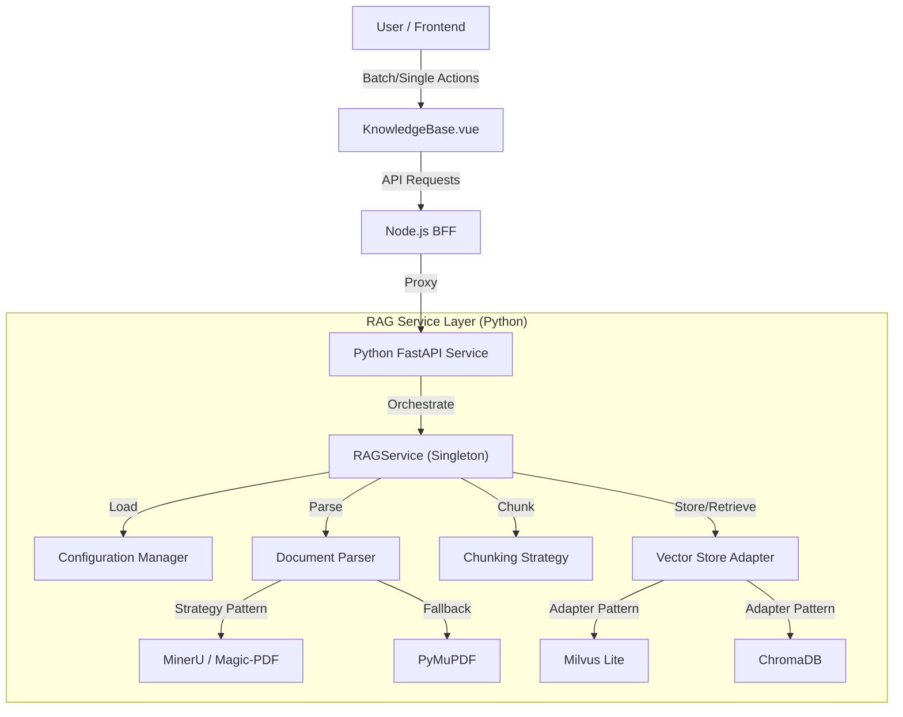

# RAG Architecture and Technical Implementation

## 1. Overview

The DeepAgents RAG (Retrieval-Augmented Generation) system is designed with modularity, configurability, and extensibility in mind. It supports multiple vector databases, configurable parsing strategies, and template-based document chunking, allowing for flexible deployment and optimization for different document types.

## 2. Architecture

The system follows a modular layered architecture, ensuring separation of concerns between the API, service logic, and underlying storage/parsing implementations.



### 2.1 Core Components

- **RAGService (`rag_service.py`)**: The main orchestrator implementing the Singleton pattern. It initializes components based on `rag_config.json` and coordinates the ingestion, search, and deletion processes. It now includes enhanced logging for better observability.
- **RAGComponents (`rag_components.py`)**: Contains the abstract interfaces and concrete implementations for:
  - `VectorStoreAdapter`: Abstract Base Class defining the contract for vector DB operations (`ingest`, `search`, `delete`).
  - `ChunkingStrategy`: Logic for splitting text based on configurable templates.
  - `MilvusAdapter` & `ChromaAdapter`: Concrete implementations for specific vector stores.
- **Configuration (`rag_config.json`)**: Centralized JSON configuration for all RAG behaviors.

## 3. Configuration

The system behavior is controlled by `libs/deepagents-web/services/python/rag_config.json`. This allows modifying behavior without code changes.

### 3.1 Vector Store Configuration
Supports switching between Milvus and ChromaDB, with automatic fallback capabilities.

```json
"vector_store": {
  "type": "milvus",
  "fallback_to_chroma": true,
  "milvus": {
    "uri": "milvus_kb.db",
    "collection_name": "deepagents_kb",
    "dimension": 384
  },
  "chroma": {
    "collection_name": "deepagents_kb"
  }
}
```

### 3.2 Parsing Strategies
Defines which parsers to use for specific file extensions. The system attempts strategies in order.

```json
"parsing": {
  "default_strategy": "auto",
  "strategies": {
    "pdf": ["mineru", "pymupdf"],
    "txt": ["text"],
    "md": ["text"]
  }
}
```

### 3.3 Template-based Chunking
Allows defining custom chunking parameters for different document types (e.g., scientific papers vs. legal contracts).

```json
"chunking": {
  "default": {
    "chunk_size": 1000,
    "chunk_overlap": 200,
    "separators": ["\n\n", "\n", " ", ""]
  },
  "templates": {
    "scientific_paper": {
      "chunk_size": 800,
      "chunk_overlap": 150
    },
    "legal_contract": {
      "chunk_size": 500,
      "chunk_overlap": 100
    }
  }
}
```

### 3.4 Scenario Example: Technical Documentation (DOCX)

Scenario: You have "System Construction Plan" or "Test Specification" documents in `.docx` format. These documents typically feature hierarchical headings (e.g., "1.1 System Overview", "2. Test Cases") and structured lists.

**Recommended Strategy:**

1.  **Parsing**: Ensure `.docx` files are processed. The system's default text extractor handles standard DOCX content well.
2.  **Chunking Template**: Define a `technical_spec` template optimized for preserving the integrity of technical clauses and test steps.

**Configuration (`rag_config.json`):**

```json
"chunking": {
  "templates": {
    "technical_spec": {
      "description": "Optimized for structured technical specs and test plans",
      "chunk_size": 1200,
      "chunk_overlap": 250,
      "separators": ["\n## ", "\n### ", "\n\n", "\n", " "]
    }
  }
}
```

**Usage:**

When uploading the file via API:
- **Endpoint**: `POST /kb/upload`
- **Form Data**:
  - `file`: `@system_construction_plan.docx`
  - `template`: `technical_spec`

This ensures that larger sections (like complete test cases or architectural descriptions) are kept together, improving retrieval context.

### 3.5 Scenario Example: Deeply Structured DOCX with Diagrams

**Scenario**:
You have "System Construction Plans" or "Test Specifications" in `.docx` format.
-   **Structure**: Explicit 3-level headings (e.g., "1. System", "1.1 Module", "1.1.1 Component").
-   **Content**: Contains Functional Architecture Diagrams, Business Process Diagrams, and Tables.
-   **Requirement**: Chunking must respect the hierarchy. Diagrams and tables should not be split mid-way if possible.

**Design Strategy:**

1.  **Parsing (Format Conversion)**:
    -   **Objective**: Convert the opaque binary DOCX structure into a text format that preserves hierarchy.
    -   **Implementation**: The `rag_service.py` includes a `docx_text` strategy (requires `python-docx`). It maps DOCX styles (`Heading 1`, `Heading 2`, `Heading 3`) to Markdown headers (`#`, `##`, `###`).
    -   *Note on Diagrams*: Standard text parsers ignore images. To support "Architecture Diagrams", the parser would ideally need to extract image captions or use an OCR-based solution (like MinerU) to convert diagrams to textual descriptions. For this configuration, we assume the text content and captions are the primary retrieval targets.

2.  **Chunking Strategy**:
    -   **Objective**: Force splits *only* at major boundaries to keep sections intact.
    -   **Separators**: We define a strict separator list starting with the highest-level headers.

**Configuration (`rag_config.json`):**

```json
"chunking": {
  "templates": {
    "structured_docx": {
      "description": "Strict hierarchy splitting for 3-level DOCX headers",
      "chunk_size": 1000,
      "chunk_overlap": 200,
      "separators": ["\n# ", "\n## ", "\n### ", "\n\n"]
    }
  }
}
```

**How it Works**:
1.  The system tries to split at `\n# ` (Heading 1). If the section is too big...
2.  It tries to split at `\n## ` (Heading 2).
3.  Then `\n### ` (Heading 3).
4.  Finally, standard paragraphs `\n\n`.

This ensures that a "Business Process" section under Heading 3 is kept as a single chunk (if it fits within 1000 tokens), preserving the context of the flow description.

## 4. Document Preview & Chunk Visualization

The system provides a robust visual editor (`ChunkEditor.vue`) that allows users to verify and modify how their documents have been parsed and chunked.

### 4.1 Architecture: The "Blob Strategy"
To ensure accurate rendering of complex file formats (PDF, DOCX) without exposing direct file paths or dealing with CORS issues on local file systems, we implement a **Stream-to-Blob** pipeline:

1.  **Frontend Request**: `ChunkEditor` requests the file via `axios` with `responseType: 'blob'`.
    ```javascript
    const fileRes = await axios.get(`/api/v1/kb/sources/${props.sourceId}/file`, {
        responseType: 'blob'
    })
    ```
2.  **BFF Proxy**: The Node.js BFF (`kb.ts`) streams the response from the Python backend to the client. It is crucial that the BFF propagates the `Content-Type` header so the browser knows how to handle the binary stream.
    ```typescript
    // BFF: kb.ts
    response.body.pipe(res) // Pipes the stream directly
    ```
3.  **Client Rendering**: The frontend converts the received Blob into an Object URL (`URL.createObjectURL(blob)`).
    -   **PDFs**: Rendered using `@vue-office/pdf`.
    -   **DOCX**: Rendered using `@vue-office/docx`.
    -   **Text/Code**: Decoded directly from the blob text.

### 4.2 Chunk Visualization & Pagination
To handle documents with hundreds of chunks without performance degradation or UI clutter:

-   **Pagination**: Chunks are displayed in pages (default 3 per page) to ensure the UI remains responsive and "refined" (not overwhelming).
-   **Uniform Distribution**: The layout guarantees chunks are evenly spaced using Flexbox, preventing layout shifts.
-   **Interactive Editing**: Users can click any chunk to edit its text content. Changes are saved back to the vector store via `PUT /kb/chunks/{id}`.

## 5. Implementation Guide: Creating Custom Strategies

To orchestrate a new RAG strategy for a specific document type (like the "System Construction Plan" example), follow these steps:

### Step 1: Analyze Document Structure
Open your target document (e.g., `system_plan.docx`) and identify:
1.  **Hierarchy**: What styles are used for headers? (e.g., standard `Heading 1`, `Heading 2`).
2.  **Key Elements**: Are there tables, diagrams, or code blocks?
3.  **Chunking Goal**: Do you want to retrieve whole chapters, or just paragraphs?
    *   *Example*: "I need to retrieve the entire '3.1 User Login' section including its flow diagram description."

### Step 2: Select or Implement Parsing Strategy
Determine if existing parsers (`text`, `pymupdf`, `mineru`, `docx_text`) are sufficient.
*   **For DOCX**: The built-in `docx_text` strategy extracts text and converts `Heading 1-3` to Markdown (`#`, `##`, `###`). It also appends Tables at the end of the document.
*   **Custom Needs**: If you need to extract image captions or keep tables interleaved precisely, you would modify `rag_service.py` to implement a custom parsing logic (e.g., `_parse_docx_advanced`).

### Step 3: Configure Chunking Template
Add a new template to `rag_config.json` in the `chunking.templates` section.
*   **Separators**: Choose separators that match the structure identified in Step 1.
    *   For strict hierarchy: `["\n# ", "\n## ", "\n### "]`
*   **Size/Overlap**: Adjust based on the average length of your sections.

```json
"my_custom_doc": {
  "description": "Custom strategy for project plans",
  "chunk_size": 1500,
  "chunk_overlap": 300,
  "separators": ["\n# ", "\n## ", "\n### ", "\n\n"]
}
```

### Step 4: Execution
When uploading the file, specify your new template.
*   **API**: `POST /kb/upload` with `file=@my_doc.docx` and `template=my_custom_doc`.
*   **Frontend**: In `KnowledgeBase.vue`, ensure the upload component allows selecting this template (or defaults to it based on file type if logic is added).

## 6. Technical Implementation Workflow: Custom Document Type

To implement a fully customized workflow for a specific document type (e.g., "System Construction Plan"), follow these steps to orchestrate the RAG components:

### Step 1: Design the Orchestration Flow
We utilize the **Strategy Pattern** for parsing and **Template Pattern** for chunking.
*   **Input**: User uploads `.docx` with `template="system_plan"`.
*   **Orchestration**:
    1.  **Route**: `RAGService` detects `.docx` extension → activates `docx_text` Parsing Strategy.
    2.  **Transform**: Parser iterates through DOCX elements (Headers, Paragraphs, Tables) → converts to structured Markdown (e.g., converting "Heading 2" style to `##`).
    3.  **Chunk**: `ChunkingStrategy` receives the `template` name → loads specific `separators` → executes recursive splitting.

### Step 2: Implement/Verify Parser Logic
Ensure the parser (`rag_service.py`) captures the document's unique structural elements.

*Code Reference: `rag_service.py` (docx_text strategy)*
```python
# Logic to map DOCX styles to Markdown headers
if para.style.name.startswith('Heading 1'):
    full_text.append(f"# {para.text}")
# ...
```

### Step 3: Define Chunking Template
Add a new configuration block in `rag_config.json` designed for the document's density.

*   **For "Test Specifications"**: Use strict separators to keep Test Case ID and Steps together.
    ```json
    "test_spec": {
      "chunk_size": 800,
      "chunk_overlap": 100,
      "separators": ["\n### ", "\n\n"] 
    }
    ```
    *(Note: Using `\n### ` as the first separator forces splits at Test Cases if they are Heading 3)*

### Step 4: Execution
Trigger the orchestrated flow via the API.

```bash
curl -X POST "http://localhost:8001/kb/upload" \
  -F "file=@/path/to/System_Plan_V1.0.docx" \
  -F "template=test_spec"
```

## 7. Technical Implementation


### 7.1 Modularity via Adapters
We use the **Adapter Pattern** to decouple the RAG logic from specific vector database implementations. `VectorStoreAdapter` defines a unified interface, allowing seamless switching between Milvus and Chroma without changing the core service logic.

### 7.2 Strategy Pattern for Parsing
Parsing logic is implemented using the **Strategy Pattern**. The `ingest_file` method iterates through configured strategies for the given file extension until one succeeds. This ensures robustness (e.g., automatically falling back to PyMuPDF if the high-fidelity MinerU parser fails).

### 7.3 Template Injection
When uploading a file, a `template` parameter can be passed. The `ChunkingStrategy` class uses this key to look up specific splitting parameters from the configuration, enabling domain-specific optimization of retrieval granularity.

## 8. Frontend Integration

The **Knowledge Base UI** (`KnowledgeBase.vue`) provides a comprehensive interface for managing data sources:

- **Batch Management**: Users can select multiple files using the "Select All" checkbox or individual selection.
- **Batch Deletion**: Supported via the `deleteSelectedSources` method, which executes parallel API calls (`Promise.all`) for efficiency.
- **Preview & Editing**: The `ChunkEditor` component allows users to:
    - View the original document (PDF/DOCX) side-by-side with its chunks.
    - Edit chunk text to correct parsing errors.
    - Navigate through chunks using pagination controls.
- **Search Testing**: integrated search bar to test retrieval relevance immediately after ingestion.

## 9. API Endpoints

The Python FastAPI service (`app.py`) exposes the following key endpoints:

- **`POST /kb/upload`**: Uploads and ingests a file. Accepts optional `template` parameter.
- **`POST /kb/query`**: Semantic search against the vector store.
- **`GET /kb/sources`**: Lists all indexed sources.
- **`DELETE /kb/sources/{sid}`**: Removes a source and its vectors from the database.
- **`GET /kb/sources/{sid}/preview`**: Retrieves chunk details for inspection.
- **`GET /kb/sources/{sid}/file`**: Streams the raw file content (supporting range requests and correct MIME types).

## 10. Testing & Verification

With the removal of temporary test scripts, verification relies on:

- **UI Verification**: Use the `KnowledgeBase.vue` interface to upload files, perform batch deletions, and verify search results.
- **API Verification**: Use `curl` or Postman to test endpoints defined in `app.py`.
- **Logs**: Check standard output for RAG service logs, which now include detailed information about ingestion progress and vector store operations.

## 11. Future Extensions

- **Pipeline Config**: Add pre-processing steps (cleaning, PII redaction) to the configuration.
- **Model Selection**: Allow configuring different embedding models per collection via the API.
- **Hybrid Search**: Enable keyword + vector hybrid search configuration for better retrieval accuracy.

## 12. Implementation Plan: MBSE SysML V1.0 Support

To extend the RAG system to support Model-Based Systems Engineering (MBSE) data (specifically SysML V1.0), we will implement a dedicated pipeline for processing XMI (XML Metadata Interchange) files. This allows engineers to query requirements, block definitions, and relationships directly from the system model.

### 12.1 Architecture Extension

*   **Input Format**: Standard XMI 2.1 files exported from tools like MagicDraw/Cameo or Enterprise Architect.
*   **New Component**: `SysMLParser` (integrated via the Strategy Pattern).
*   **Data Transformation**: "Serialization" of graph-based model elements into semantic text descriptions suitable for vector embedding.

### 12.2 Implementation Roadmap

#### Phase 1: XMI Parsing Infrastructure
1.  **Dependencies**: Introduce `lxml` for high-performance XML traversal.
2.  **Parser Logic (`rag_service.py`)**:
    *   Implement `_parse_sysml_xmi` strategy.
    *   **Namespace Handling**: Handle standard OMG namespaces (`uml`, `xmi`, `sysml`).
    *   **Element Extraction**: Focus on core SysML constructs:
        *   `Requirements` (id, text, name)
        *   `Blocks` (properties, operations)
        *   `UseCases` (actors, descriptions)

#### Phase 2: Model-to-Text Serialization
Convert the hierarchical/graph XMI structure into a flat, readable format for the LLM.

*   **Source (XMI Fragment)**:
    ```xml
    <packagedElement xmi:type="sysml:Requirement" xmi:id="REQ-001" name="Latency">
        <body>System response time shall be < 50ms.</body>
    </packagedElement>
    ```
*   **Target (Markdown)**:
    ```markdown
    # Requirement: Latency (ID: REQ-001)
    **Description**: System response time shall be < 50ms.
    **Type**: Functional
    ```

#### Phase 3: Relationship Mapping (Advanced)
*   **Goal**: Capture traceability links (`Satisfy`, `Verify`, `Refine`).
*   **Implementation**: When parsing a Requirement, look up incoming/outgoing links in the XMI relationship table and append them to the text description (e.g., `Relation: Satisfied by Block [PowerUnit]`).

### 12.3 Configuration Preview

**`rag_config.json` updates:**

```json
"parsing": {
  "strategies": {
    "xmi": ["sysml_xmi"],
    "xml": ["sysml_xmi"]
  }
},
"chunking": {
  "templates": {
    "sysml_model": {
      "description": "Atomic chunking per model element",
      "chunk_size": 2000, 
      "chunk_overlap": 0,
      "separators": ["\n# Requirement:", "\n# Block:", "\n# UseCase:"]
    }
  }
}
```

### 12.4 Usage Workflow
1.  **Export**: User exports model package to `.xmi`.
2.  **Upload**: `POST /kb/upload` with `file=@model.xmi` and `template=sysml_model`.
3.  **Query**: "What are the latency requirements?" -> RAG retrieves the specific Requirement element.
