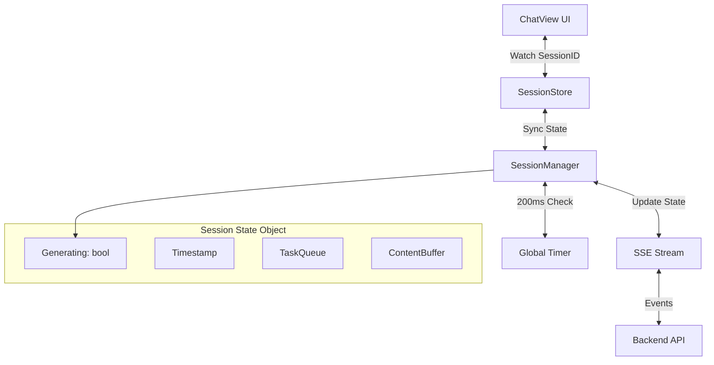

# Session State Collaborative Management System

## 1. Technical Architecture

### 1.1 Overview
The Session State Collaborative Management System ensures strong binding and synchronization between the UI (Send/Stop buttons) and backend session states. It uses a centralized `SessionManager` in the frontend store to track the state of all sessions, handling background tasks, timeouts, and state restoration upon session switching.

### 1.2 Data Flow


## 2. State Management Mechanism

### 2.1 Session State Object
Each session has an independent state object stored in `SessionManager.sessionStates`:
```typescript
interface SessionState {
  generating: boolean      // Is the session currently generating content?
  lastActive: number       // Timestamp of last activity
  taskQueue: SessionTask[] // Queue of pending tasks (generation, tools)
  contentBuffer: string    // Temporary buffer for streaming content
}
```

### 2.2 Global Session Manager
The `SessionManager` is a reactive object responsible for:
- Tracking `activeSessionId`
- Maintaining the `sessionStates` Map
- Running the `checkGlobalStatus` loop (200ms interval)
- Handling timeouts and resource cleanup

### 2.3 Synchronization Flow
**When switching sessions:**
1. User clicks session -> `sessionStore.setSessionId(newId)`
2. `sessionManager.activeSessionId` updates.
3. `ChatView` watcher triggers `loadSessionHistory`.
4. `isStreaming` computed property updates based on `sessionManager.getState(newId).generating`.
5. UI buttons (Send/Stop) update immediately to reflect the state of the *new* session.

## 3. Background Task & Exception Handling

### 3.1 Task Priority Queue
- **Active Session Tasks**: Processed with high priority (UI updates immediately).
- **Inactive Session Tasks**: Tracked in background; state is preserved but UI is not updated until switched to.

### 3.2 State Perception (Timer)
- **Interval**: 200ms
- **Logic**:
  - Iterates through all `sessionStates`.
  - Checks for timeouts (>30 mins inactive).
  - Can be extended to poll backend status if SSE disconnects.

### 3.3 Exception Handling
| Scenario | Handling Mechanism |
| :--- | :--- |
| **Network Interrupt** | SSE `onerror` triggers `closeStream`; `SessionManager` preserves `contentBuffer`. |
| **Session Timeout** | `checkGlobalStatus` detects `lastActive > 30min`. Clears `contentBuffer` and tasks. |
| **State Inconsistency** | `resetSessionState(id)` forces `generating=false` and clears queue. |

## 4. API Interface Definition (Internal Store API)

### `sessionManager`
- `init()`: Starts the status timer.
- `getState(sessionId)`: Returns `SessionState` (creates if missing).
- `updateState(sessionId, partialState)`: Updates state and `lastActive`.
- `addTask(sessionId, task)`: Adds task to queue.
- `completeTask(sessionId, taskId)`: Removes task from queue.
- `resetSessionState(sessionId)`: Force reset of session state.

### `chatStore` Integration
- `connectToStream(sid)`: Sets `generating=true` in Manager.
- `closeStream()`: Sets `generating=false` in Manager.
- `onmessage`: Updates `contentBuffer` in Manager.

## 5. Error Codes & Test Cases

### 5.1 Error Codes
| Code | Description | Recovery |
| :--- | :--- | :--- |
| `ERR_SSE_PARSE` | Failed to parse SSE JSON | Log error, continue stream |
| `ERR_SSE_CONN` | SSE Connection closed unexpectedly | Mark message as error, stop generating |
| `ERR_TIMEOUT` | Session inactive for >30m | Resources cleaned up automatically |

### 5.2 Test Cases (Acceptance Criteria)

#### TC1: Session Switch Consistency
1. Start generation in Session A.
2. Switch to Session B (empty).
3. **Expect**: Session B shows "Send" button.
4. Switch back to Session A.
5. **Expect**: Session A shows "Stop" button (if still generating) or updated content.

#### TC2: Background Completion
1. Start generation in Session A.
2. Switch to Session B.
3. Wait for Session A generation to finish (mocked or real).
4. Switch back to Session A.
5. **Expect**: Content is fully populated, button is "Send".

#### TC3: Timeout Cleanup
1. Set Session A `lastActive` to 31 mins ago.
2. Wait for next timer tick (max 200ms).
3. **Expect**: `contentBuffer` for Session A is cleared.

#### TC4: Force Reset
1. Induce "stuck" state (generating=true but no stream).
2. Call `resetSessionState(id)`.
3. **Expect**: `generating` becomes false, task queue empty.
